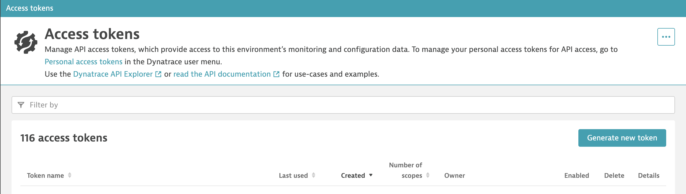
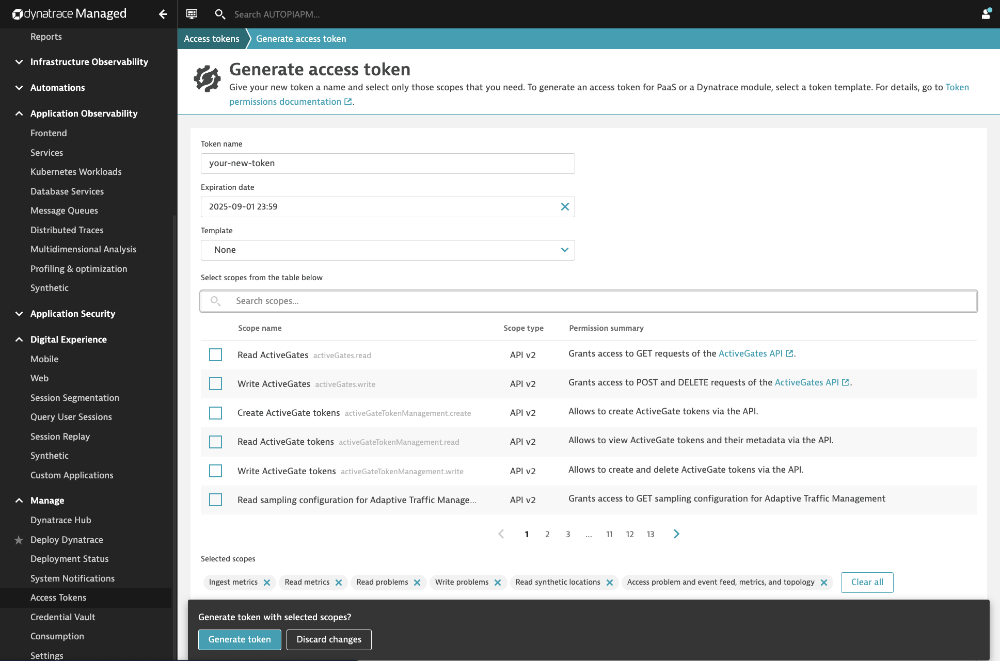
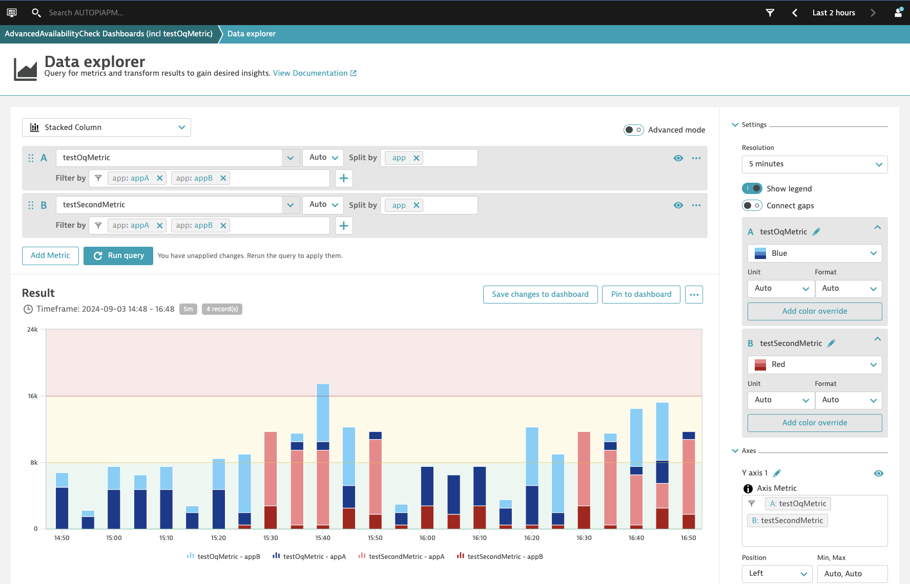
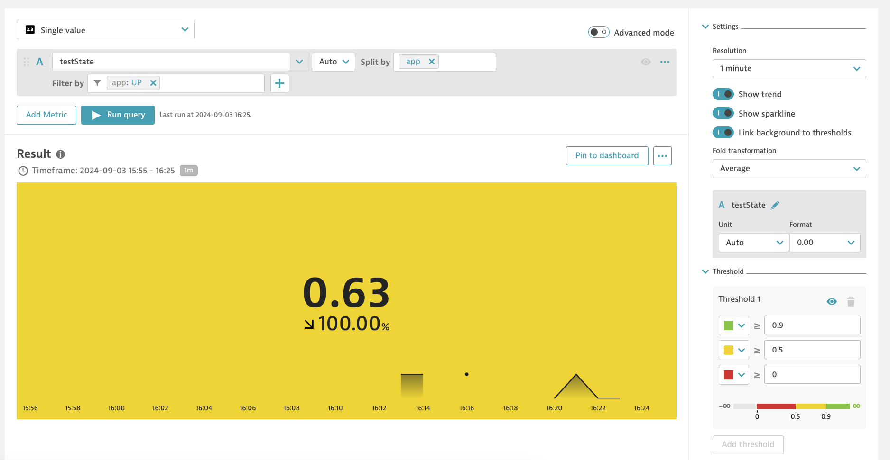
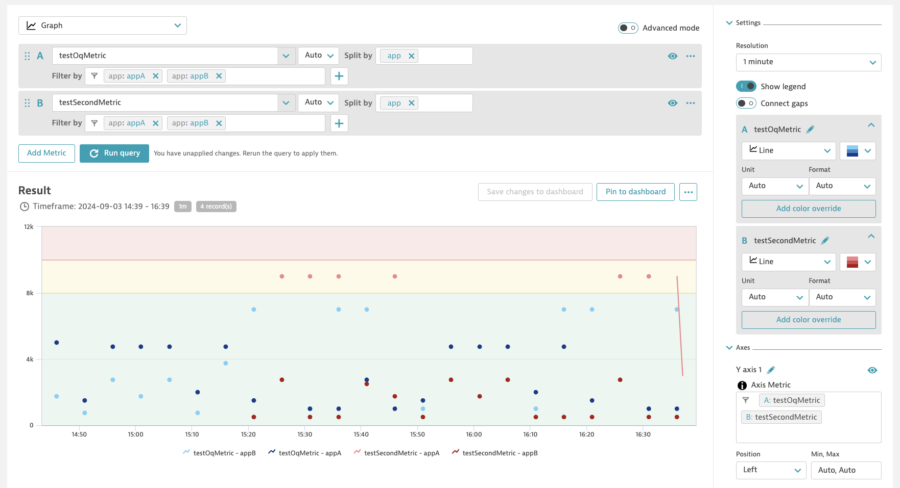

# Advanced Availability Check

Table of Contents
* [Description](#description)
* [Requirements](#requirements)
* [How to use](#how-to-use)

## Description

**Advanced Availability Check** is designed to assess the availability of a given service and subsequently report the results to Dynatrace. This enables comprehensive monitoring, tracking of Service Level Agreements (SLAs), and data visualization within the Dynatrace platform.

For demonstration and testing purposes, this example utilizes the HTTP Bin service. It is a simple HTTP request and response service, which allows for easy testing and exploration of HTTP requests and responses. However, this example can be readily adapted to fit specific customer requirements and use cases with different services.

By following this documentation, can be implement an advanced and reliable mechanism to monitor the availability of services thereby enhancing the operational efficiency and service reliability.

On top of that, availability checks can easily be performed on regular intervals (e.g. every 5 minutes or every hour) by using the [Scheduled Executions](https://help.sap.com/docs/AUTOMATION_PILOT/de3900c419f5492a8802274c17e07049/96863a2380d24ba4bab0145bbd78e411.html) functionality in Automation Pilot.

## Requirements
To use this example you’ll need the following:
* Dynatrace setup with access token and environment url

:information_source: How to setup your Dynatrace

* From the left panel click on **Manage** and navigate to **Access Tokens**

* Go to **Geneterate new token** 
* Chose a *token name* and *expiration date* 
* Add the *scopes* shown in the picture

* Click on **Generate Token** and save your access token securely
* The **environment url** can be cound in the *Dynatrace Environment API Documentation*

:information_source: Result of the **Dynatrace** setup can be viewed in the **Data explorer** where different **Dashboards** can be configured.
* *Stacked column chart for 2 metrics and 2 applications*

* *Single value chart presenting the availability of an application*

* *Graph chart for 2 metrics and 2 applications individually*

:information_source: How to setup your Dynatrace Dashboards
* Go to **Data Explorer** under **Observe and explore** 
* Chose the *type of chart* you want and use the values pushed with **PushDynatraceMetric** command in *dataPoints*
* Select the *metric* 
* Split by the *category*
* Filter by the *name*
* Configure the Settings and Timeframes
* Finally **Pin to dashboard**

Check out the following resource for more information
* [Dynatrace Documentation](https://docs.dynatrace.com/docs)
* [Dynatrace Environment API Documentation](https://live.eu10.apm.services.cloud.sap/e/60049331-b187-4a09-8a99-be150740f608/rest-api-doc/index.jsp)

## How to use
Import the content of [examples catalog](catalog.json) in your Automation Pilot tenant. Navigate to AdvancedAvailabilityCheck command and trigger it.

You’ll need to provide values for the following input keys:
* *dynatraceApiToken* - Generated Dynatrace API Token
* *dataPoints* - Custom data points
* *dynatraceEnvironmentUrl* - Environment url for Dynatrace

> :information_source: For the *dataPoints* follow this template
> {metric},{category}={name} {payload}
>
> example: metricName, app=appA 1