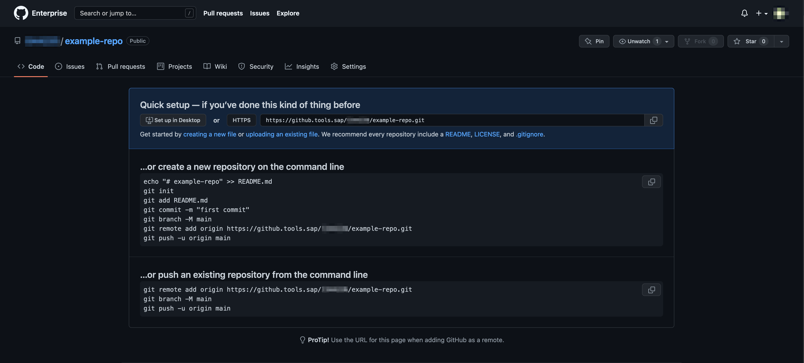
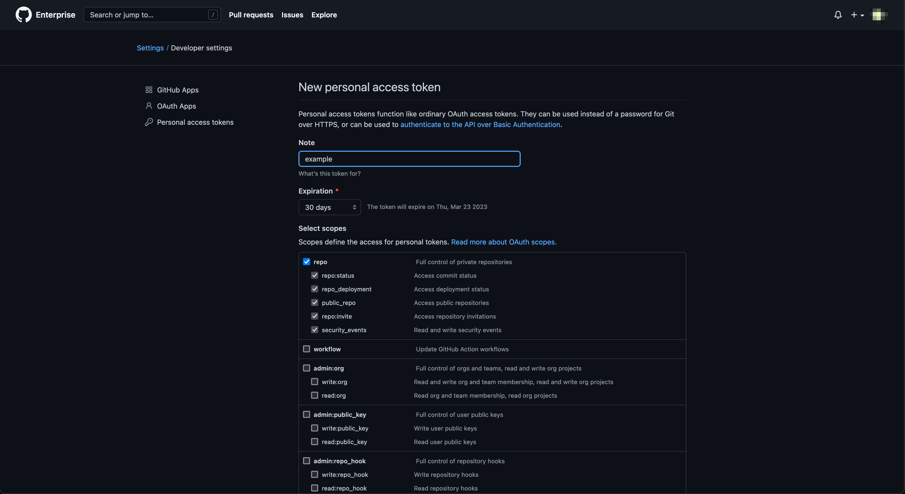
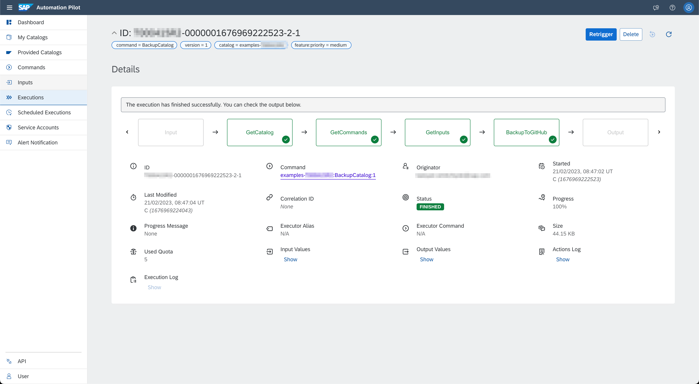
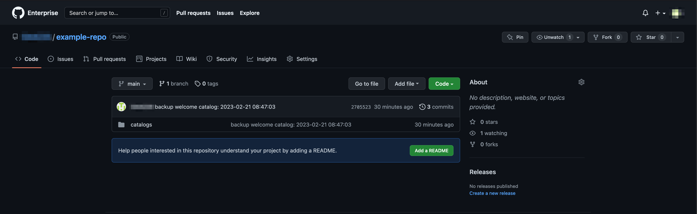
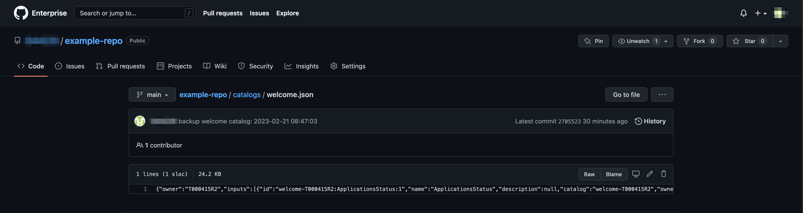

# Backup Automation Pilot Catalogs to GitHub

Table of Contents

* [Description](#description)
* [Requirements](#requirements)
* [How to use](#how-to-use)
* [Expected result](#expected-result)

## Description

Automation Pilot allows customers to create their own catalogs and populate them with custom commands and inputs which are based on the provided ones. Customers can [export](https://help.sap.com/docs/AUTOMATION_PILOT/de3900c419f5492a8802274c17e07049/48ee09640e094bcb9601d845f316f773.html) these catalogs from the UI and store them somewhere as a backup. If needed, they could be imported back into the same or another Automation Pilot tenant.

In this example, we'll look over a command that automates the Automation Pilot catalog backup process. This command utilizes the Automation Pilot and GitHub APIs to extend the service's functionality.

It performs the following steps:

* Gets all commands and inputs which are part of a specified catalog by using the [Automation Pilot APIs](https://api.sap.com/package/SAPCloudPlatformAutomationPilot/rest)
* Stores the result in a GitHub repository by creating or updating a file at a given path

:warning: Values that are marked as sensitive in your inputs will not be backed up.

On top of that, backup easily be performed on regular intervals (e.g., every day or week) by using the [Scheduled Executions](https://help.sap.com/docs/AUTOMATION_PILOT/de3900c419f5492a8802274c17e07049/96863a2380d24ba4bab0145bbd78e411.html) functionality in Automation Pilot.

## Requirements

To use this example you'll need the following:

* Repository in a GitHub Enterprise server
* Personal access token of a user with write access to the repository. Note that if your repository is private, token must be granted the *repo* scope
* Automation Pilot service account with 'Read' permissions

Check out the following resources for more information:

* [Create a GitHub repository](https://docs.github.com/en/get-started/quickstart/create-a-repo)
* [Managing teams and people with access to your GitHub repository](https://docs.github.com/en/repositories/managing-your-repositorys-settings-and-features/managing-repository-settings/managing-teams-and-people-with-access-to-your-repository)
* [Creating a GitHub personal access token](https://docs.github.com/en/authentication/keeping-your-account-and-data-secure/creating-a-personal-access-token)
* [Managing Automation Pilot Service Accounts](https://help.sap.com/docs/AUTOMATION_PILOT/de3900c419f5492a8802274c17e07049/91713d7e71624dbf92ea43f5faf810e5.html)

## How to use

Import the content of [examples catalog](catalog.json) in your Automation Pilot tenant. Navigate to the *BackupCatalog* command and trigger it.

You'll need to provide values for the following input keys:

* *githubServer* - URL to the GitHub Enterprise server
* *repository* - Name of the GitHub repository
* *owner* - Account owner of the GitHub repository. This could be the name of a personal account or organization
* *branch* - Name of the GitHub branch, e.g., *main* or *master*
* *token* - GitHub personal access token
* *user* - Name of the Automation Pilot service account
* *password* - Password of the Automation Pilot service account
* *catalog* - Technical name of the Automation Pilot catalog to backup

:warning: The GitHub branch must already exists. Also, it must not have any branch protection or mandatory review requirements. Your user must be enable to directly push commits to it.

## Expected result

Let's prepare a brand new GitHub Enterprise repository called *example-repo* (you can also use an existing one):

We'll also create a GitHub personal access token with the *repo* scope:

We'll start the execution with the following input. Some of the keys are omitted for brevity:

* *catalog* - welcome
* *path* - catalogs
* *branch* - main

Once triggered, the execution should quickly finish successfully:

Going back to the GitHub repository, we can see that the catalog content is uploaded:

