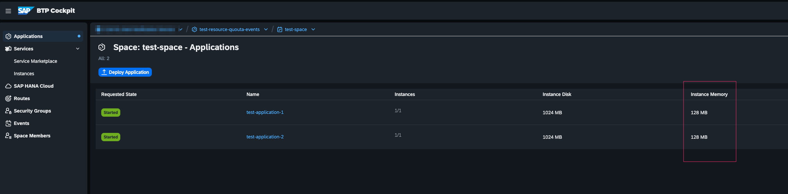
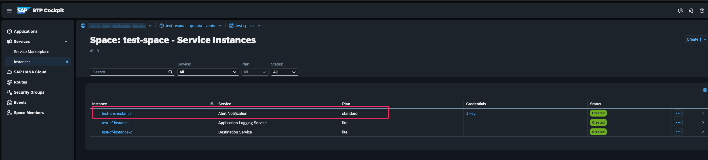
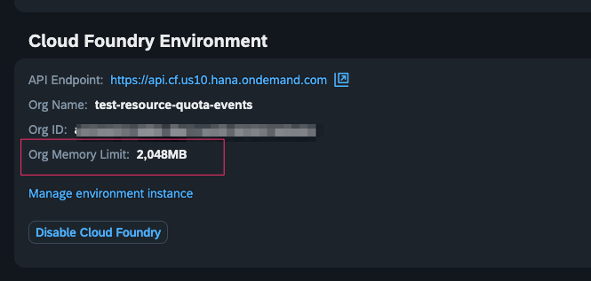
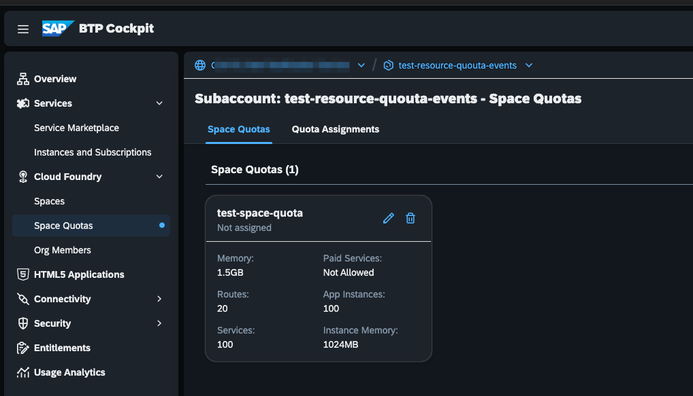
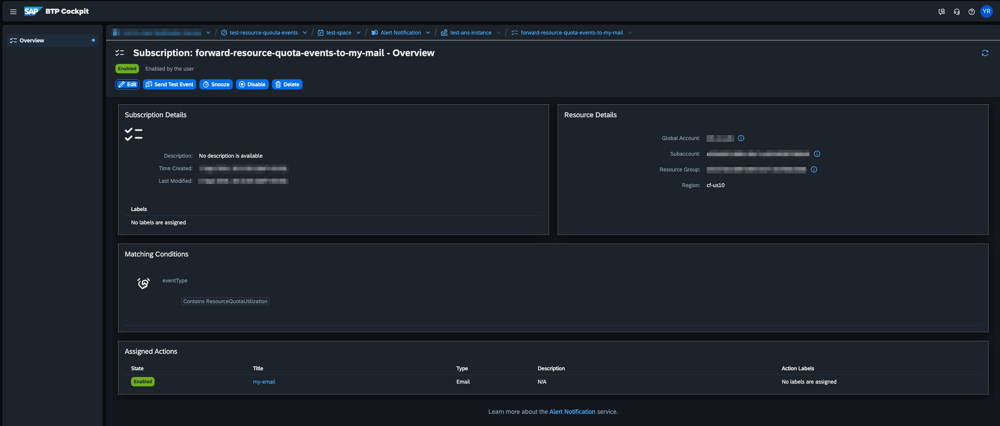
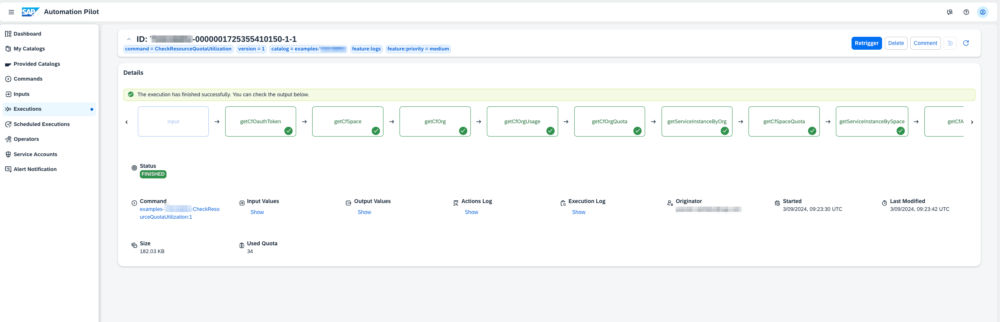
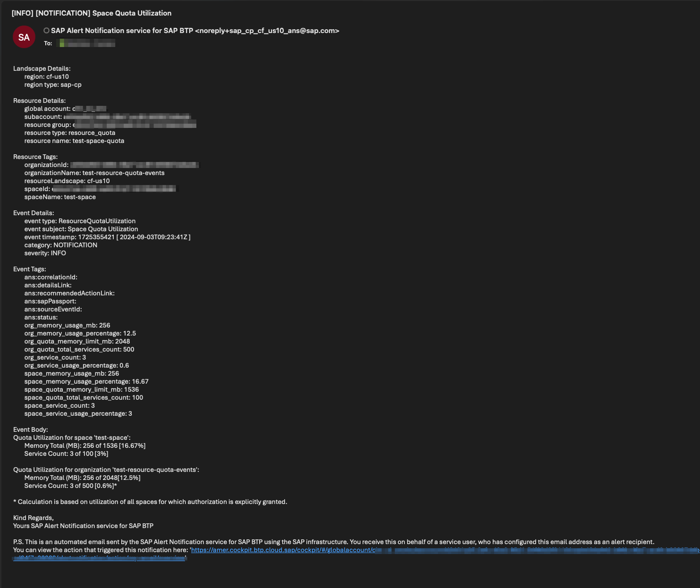

# Receive notifications about Cloud Foundry resources utilization via SAP Alert Notification service

Table of Contents

* [Description](#description)
  * [Event Details](#event-details)
  * [High-level Overview](#high-level-overview)
  * [Example Event Payload](#example-event-payload)
* [Requirements](#requirements)
* [Prerequisites](#prerequisites)
* [How to use](#how-to-use)
* [Expected result](#expected-result)

## Description

This command allows you to get insights about the resource utilization in your Cloud Foundry runtime, like memory consumption and service usage in your Cloud Foundry space and its parent Cloud Foundry organization.
These insights can be forwarded towards your [SAP Alert Notification service](https://help.sap.com/docs/alert-notification/sap-alert-notification-for-sap-btp/what-is-sap-alert-notification-service-for-sap-btp) account where you can subscribe for events regarding your resource consumption.
By using an appropriate configuration you could get informed about detailed resource usage, and you can also be notified when your resource usage is close to the quota defined for your space and organization as well.
The event which will be triggered towards your SAP Alert Notification instance is described in the section below. On top of that you can get notified about your Cloud Foundry resource consumption on regular intervals (e.g., every hour or day) by using [Scheduled Executions](https://help.sap.com/docs/automation-pilot/automation-pilot/scheduled-execution?locale=en-US). 

It is important to understand that using this command will result in being billed seperatelly: once for the executions in SAP Automation Pilot and again for processing the event in the SAP Alert Notification service. Additionally, there is a notable difference between this command and the now-deprecated native resource quota utilization event. 
This command relies on the Cloud Foundry V3 API. Although the CF V3 API is more modern compared to the CF V2 API, maintaining the functionality previously achieved with the V2 API will require a greater number of API requests. Events would also be generated on an hourly basis due to technical constraints instead of the 30 minute timeframe utilized before. On the other hand, this command presents the opportunity to customize the event to your liking and you are free to edit the examples referred to in this documenent.

For more information, you can refer to the CF V3 API documentation [here](https://v3-apidocs.cloudfoundry.org/version/3.184.0/index.html#introduction)

### High-level Overview

The following executors are utilized when using this command: 

* Executor ```getCfSpace``` runs a ```GET``` request to the ```/v3/spaces/:guid``` endpoint to acquire the Cloud Foundry Space ID and related Cloud Foundry Organization.

* Executor ```getCfOrg``` runs a ```GET``` request to the ```/v3/organizations/:guid``` endpoint to acquire the Cloud Foundry Organization Quota GUID.

* Executor ```getCfOrgUsage``` runs a ```GET``` request to the ```/v3/organizations/:guid/usage_summary``` to acquire the specified Cloud Foundry Organization object's memory and app instance usage summary.

* Executor ```getCfOrgQuota``` runs a ```GET``` request to the ```/v3/organization_quotas/:guid``` endpoint to acquire the quota details of the Cloud Foundry Organization.

* Executor ```getServiceInstanceByOrg``` runs a ```GET``` request to the ```/v3/service_instances/:guid``` endpoint to acquire all the instances contained in the specific Cloud Foundry Organization.

* Executor ```getCfSpaceQuota``` runs a ```GET``` request to the ```/v3/space_quotas/:guid``` endpoint to acquire the Cloud Foundry Space Quota.

* Executor ```getServiceInstanceBySpace``` runs a ```GET``` request to the ```/v3/service_instances?space_guids=<space-guid>``` request with the ```space_guids``` parameter to fetch all the service instances in a space.

* Executor ```getCfApps``` relies on the ```ListCfApps``` command that lists all the Cloud Foundry application in a selected space. 

* Executor ```calculateSpaceMemory```  relies on the input key ```appResources``` that consists of the resourceNames of all the applications in a given space. This input key is based on the information received when executing the ```ListCfApps``` command. ```calculateSpaceMemory``` then calculates the memory usage of every single application by using the ```calculateAppMemory```.

* Executor ```calculateSpaceMemoryPercentage``` calculates the space memory usage in percentages.

* Executor ```calculateOrgMemoryPercentage``` calculates the organization memory usage in percentages.

* Executor ```SendAnsEvent``` send the event data to SAP Alert Notification Service where it would be processed according to your configuration.

### Event Details

| Event Property | Value |
| -------------- | ----- |
| eventType | **ResourceQuotaUtilization** |
| severity | **INFO** |
| category | **NOTIFICATION** |
| priority | n/a |
| subject | The subject is a constant value: **Space Quota Utilization** |
| body | The value of this parameter is the following text:<br>**Quota Utilization for space <space name>:**<br>**Memory Total (MB):** <used memory in space> of <memory quota for the space> [<percentage>%]<br>**Service Count:** <number of services in space> of <service quota for the space> [<percentage>%]<br>**Quota Utilization for organization <organization name>:**<br>**Memory Total (MB):** <total used memory in organization> of <memory quota for the organization> [<percentage>%]<br>**Service Count:** <total number of services in organization> of <service quota for the organization> [<percentage>%]<br>*Calculation is based on utilization of all spaces for which authorization is explicitly granted.* |
| resource | ... |
| tags | ... |
| region | Technical name of the SAP BTP environment and landscape your subaccount is on. |
| regionType | **Example: sap-cp** |

The **resource** object contains:
| Property | Description or Value |
| ------------------------ | ---------------------|
| resource.globalAccount | Global account identifier. |
| resource.subAccount | The GUID of the Cloud Foundry organization. |
| resource.resourceGroup | The GUID of the Cloud Foundry space. |
| resource.resourceType | **resource_quota** |
| resource.resourceName | The name of the quota definition |
| resource.resourceInstance | n/a. |

The **tags** object contains:
| Tag | Value |
| --------------------------------- | ----- |
| tags.space_memory_usage_mb | Total memory used in the space in megabytes. |
| tags.space_quota_memory_limit_mb | The memory limit in megabytes according to the space quota plan (definition) or organization quota definition, in case quota plan is not assigned for the space (-1 means “unlimited”). |
| tags.space_memory_usage_percentage | Percentage of used memory quota. |
| tags.space_service_count | Total number of service instances used in space. |
| tags.space_quota_total_services_count | The maximum number of services that could be instantiated in this space according to space quota plan (definition) or organization quota definition, in case quota plan is not assigned for the space (-1 means “unlimited”). |
| tags.space_service_usage_percentage | Percentage of used service quota. |
| tags.org_memory_usage_mb | Total memory used in the organization in megabytes. |
| tags.org_quota_memory_limit_mb | The memory limit in megabytes according to the organization quota definition (-1 means “unlimited”). |
| tags.org_memory_usage_percentage | Percentage of used memory quota for organization. |
| tags.org_service_count | Total number of service instances used in organization. |
| tags.org_quota_total_services_count | The maximum number of services that could be instantiated in this organization according to organization quota definition (-1 means “unlimited”). |
| tags.org_service_usage_percentage | Percentage of used service quota. |
| tags.ans:eventScope | **CF_SPACE** |

### Example Event Payload
<details>
<summary><b><i>Use the following payload to test out your subscription in the BTP Cockpit</i></b></summary>
  
For more details on how to test your subscription, see [Managing Subscriptions](https://help.sap.com/docs/alert-notification/sap-alert-notification-for-sap-btp/managing-subscriptions#testing-subscriptions)

  ```JSON
      {
       "body": "Quota Utilization for space 'mySpace':\n\tMemory Total (MB): 7768 of 12288 [63.2%]\n\tService Count: 16 of 350 [4.57%]\n\nQuota Utilization for organization 'myOrganization':\n\tMemory Total (MB): 70960 of 96256 [73.7%]\n\tService Count: 59 of 940 [6.28%]*\n\n* Calculation is based on utilization of all spaces for which authorization is explicitly granted.",
       "category": "NOTIFICATION",
       "eventTimestamp": 1591369204,
       "eventType": " ResourceQuotaUtilization",
       "priority": null,
       "resource": {
           "resourceInstance": null,
           "resourceName": "dev_plan",
           "resourceType": " resource_quota",
           "tags": {}
        },
        "severity": "INFO",
        "subject": " Space Quota Utilization",
        "tags": {
            "org_memory_usage_percentage": "73.7",
            "space_service_count": "16",
            "org_memory_usage_mb": "70960",
            "space_service_usage_percentage": "4.57",
            "space_memory_usage_mb": "7768",
            "space_memory_usage_percentage": "63.2",
            "org_quota_total_services_count": "940",
            "space_quota_total_services_count": "350",
            "org_service_usage_percentage": "6.28",
            "org_quota_memory_limit_mb": "96256",
            "org_service_count": "59",
            "space_quota_memory_limit_mb": "12288"
        }
    }
  ```
</details>

<details>
<summary><b><i>The following payload is sent by SAP Alert Notification service on a webhook if no payload template is applied</i></b></summary>

  ```JSON
      {
       "body": "Quota Utilization for space 'mySpace':\n\tMemory Total (MB): 7768 of 12288 [63.2%]\n\tService Count: 16 of 350 [4.57%]\n\nQuota Utilization for organization 'myOrganization':\n\tMemory Total (MB): 70960 of 96256 [73.7%]\n\tService Count: 59 of 940 [6.28%]*\n\n* Calculation is based on utilization of all spaces for which authorization is explicitly granted.",
       "category": "NOTIFICATION",
       "eventTimestamp": 1591369204,
       "eventType": " ResourceQuotaUtilization",
       "id": "c5441b0a-b434-499e-bdfa-8d9354fbfb80",
       "priority": null,
       "region": "cf-eu10",
       "regionType": "sap-cp",
       "resource": {
           "globalAccount": null,
           "resourceGroup": "b2fe70d7-56b1-48d6-ac5e-e93f2c8e70cd",
           "resourceInstance": null,
           "resourceName": "dev_plan",
           "resourceType": " resource_quota",
           "subAccount": "1ee4f517-072a-4392-9ae6-15bd38273be6",
           "tags": {}
        },
        "severity": "INFO",
        "subject": " Space Quota Utilization",
        "tags": {
            "org_memory_usage_percentage": "73.7",
            "space_service_count": "16",
            "org_memory_usage_mb": "70960",
            "space_service_usage_percentage": "4.57",
            "space_memory_usage_mb": "7768",
            "space_memory_usage_percentage": "63.2",
            "org_quota_total_services_count": "940",
            "space_quota_total_services_count": "350",
            "org_service_usage_percentage": "6.28",
            "org_quota_memory_limit_mb": "96256",
            "org_service_count": "59",
            "space_quota_memory_limit_mb": "12288",
            "ans:eventScope": "CF_SPACE"
        }
      }
  ```

</details>

## Requirements

* A Cloud Foundry Runtime within SAP BTP.

* An instance of [SAP Alert Notification service instance](https://help.sap.com/docs/alert-notification/sap-alert-notification-for-sap-btp/initial-setup) in the Cloud Foundry space which resource utilization metrics will be pulled.

* A technical user with **Space Auditor** and **Organization Auditor** roles in Cloud Foundry space and the corresponding organization that will be used to access the resource data in the Cloud Foundry space. For further information about user management refer to the following [documentation](https://help.sap.com/docs/btp/sap-business-technology-platform/administration-and-operations-in-cloud-foundry-environment).

## Prerequisites

* Create an instance of SAP Alert Notification service and configure a subscription that will match the Resource quota utilization event. You may also directly import the following [example Alert Notification service configuration](alert_notification_configuration.json) that will forward the resulting event from the command execution to your email.

**NOTE: Replace the ``<<your-email-address>>`` placeholder with the actual email address where you want to receive the event.**

## How to use

First you would need to import the content of [example catalog](catalog.json) in your SAP Automation Pilot tenant from the **My Catalogs** tab. This action will add a new catalog called ```Automation Pilot Examples```. Navigate to the ```CheckResourceQuotaUtilization``` command that this new catalog provides and select ```Trigger```.

To successfully trigger the command you'll need to provide the relevant values for the following input keys:

* *ansServiceKey* - A Service key created in your SAP Alert Notification service instance. For further information check the [Credentials management page](https://help.sap.com/docs/alert-notification/sap-alert-notification-for-sap-btp/credential-management)
* *region* - The technical name of your SAP BTP region, e.g. cf-eu10,cf-eu20
* *user* - The email or ID of your technical user.
* *password* - The password of your technical user.
* *spaceId* - The GUID of the Cloud Foundry space which you want to receive events for.
* *identityProvider* - Optional: origin key of your identity provider. Defaults to sap.ids.

## Expected result

We have set up a Cloud Foundry Runtime and a space with 3 instances and running 2 applications with defined memory quota on space level and organization level:

Running applications in the space:



Service instances created in the space:



Cloud Foundry Organization quota configuration:



Space quota configuration:




We have also created an SAP Alert Notification instance which has a subscription that will match events with *type* that *EQUALS* to *ResourceQuotaUtilization*:



Once we trigger the command, it will start analyzing the usage data in the Cloud Foundry space and its corresponding organization as well.



In a several minutes after the command has finished its execution the result of the resource utilization analysis could be observed as an email delivered via the SAP Alert Notification service:


