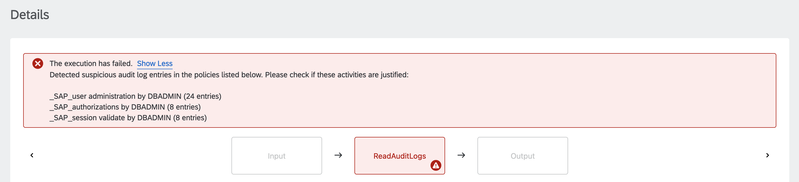

# Check HANA Cloud Database Audit Log Entries

Table of Contents

* [Description](#description)
* [Requirements](#requirements)
* [How to use](#how-to-use)

## Description

Auditing allows you to monitor and record selected actions performed in the SAP HANA Cloud database. It can help you achieve better security in the following ways:

* Uncover security vulnerabilities
* Show attempts to breach security

This example commands performs an SQL query to find any audit log entries that might be considered suspicious. It does so by pulling data from the [AUDIT_LOG system view](https://help.sap.com/docs/HANA_SERVICE_CF/7c78579ce9b14a669c1f3295b0d8ca16/d1fe1244d29510148f69be8b0e060dcc.html). If there is at least one such audit log entry, the execution fails with an error message:



:information_source: SQL query should be modified to fit the user's needs and to better detect audit log entries which should be treated as suspicious.

## Requirements

To use this example you'll need the following:

* SAP HANA Cloud database
* Enabled HANA Cloud auditing as described [here](https://learning.sap.com/learning-journey/explore-provisioning-and-administration-with-sap-hana-cloud/auditing-in-sap-hana-cloud_a6522675-08c8-45ac-801d-a2f7afe00550)
* Database user with a AUDIT ADMIN, AUDIT OPERATOR, or AUDIT READ system privilege
* JDBC URL of the following format: `jdbc:sap://<endpoint>:<port>`
* Allowed connections from Automation Pilot to your HANA Cloud database. Use [this procedure](https://help.sap.com/docs/HANA_SERVICE_CF/cc53ad464a57404b8d453bbadbc81ceb/71eb651f84274a0cb2f2b4380df91724.html) to add the NAT IPs of the [relevant Automation Pilot region](https://help.sap.com/docs/AUTOMATION_PILOT/de3900c419f5492a8802274c17e07049/4536e41c57aa442095ccbac977965f26.html#regions).

Check out the following resources for more information:

* [Deploy SAP HANA Cloud](https://developers.sap.com/tutorials/hana-cloud-deploying.html)
* [Create Users and Manage Roles and Privileges](https://developers.sap.com/tutorials/hana-cloud-mission-trial-4.html)
* [Connect to the SAP HANA Database in SAP HANA Cloud via JDBC](https://help.sap.com/docs/HANA_CLOUD/db19c7071e5f4101837e23f06e576495/030a162d380b4ec0bc6a284954c8256d.html)
* [Auditing Database Activity](https://help.sap.com/docs/HANA_CLOUD/9630e508caef4578b34db22014998dba/a7b91b9ce5864056a6868ddf5d036833.html)

## How to use

Import the content of [examples catalog](catalog.json) in your Automation Pilot tenant. Navigate to the *CheckHanaCloudAuditLogs* command and trigger it.

You'll need to provide values for the following input keys:

* *connectionUrl* - JDBC connection URL for the database
* *user* - Name of a database user
* *password* - Password for the specified database user

:information_source: If you applied SAP's recommended auditing policies settings, you can use the following SQL statement to simulate some suspicious activity:

```sql
-- Create temporary test role
CREATE ROLE TEST_ROLE;

-- Simulate suspicious activity with first user
CREATE USER TEST_USER_1 PASSWORD Abcd1234;
GRANT TEST_ROLE TO TEST_USER_1;
VALIDATE USER TEST_USER_1 PASSWORD Abcd1234;
DROP USER TEST_USER_1;

-- Simulate suspicious activity with second user
CREATE USER TEST_USER_2 PASSWORD Abcd1234;
GRANT TEST_ROLE TO TEST_USER_2;
VALIDATE USER TEST_USER_2 PASSWORD Abcd1234;
DROP USER TEST_USER_2;

-- Drop temporary test role
DROP ROLE TEST_ROLE;
```

This command is most useful when executed every day. Automation Pilot allows executions to be automatically triggered on regular intervals - hourly, daily, weekly, monthly or yearly. You can find more details in the [documentation](https://help.sap.com/docs/AUTOMATION_PILOT/de3900c419f5492a8802274c17e07049/96863a2380d24ba4bab0145bbd78e411.html).

Another important aspect is alerting. It's important to receive notifications (in the form of email, slack message, Jira ticket or other) whenever the *CheckHanaCloudAuditLogs* command finds suspicious audit log entries. This could be easily achieved with the help of SAP Alert Notification. More information can be found [here](https://help.sap.com/docs/AUTOMATION_PILOT/de3900c419f5492a8802274c17e07049/e75533639c6d4193aa8a7e7420c25f8c.html).
