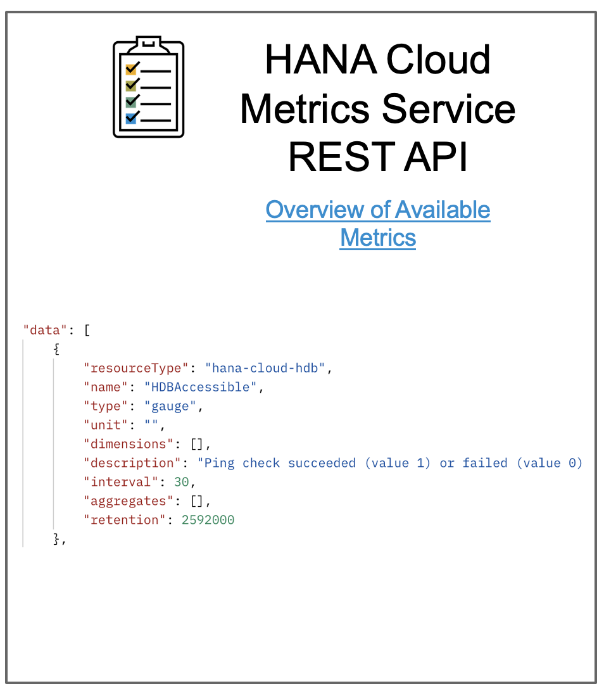

# Check HANA Cloud Availability

Table of Contents

* [Description](#description)
* [Requirements](#requirements)
* [How to use](#how-to-use)

## Description

There is a [list of monitoring metrics provided by HANA Cloud](https://help.sap.com/docs/HANA_CLOUD_DATABASE/f9c5015e72e04fffa14d7d4f7267d897/46e370ced3ef4d2bbd0ec2337df5f565.html) which are exposed via the metrics service REST API. In order to validate whether or not HANA Cloud it is available, we can look at the ping service metric `HDBAccessible` whose value is captured every 30 seconds. 

Therefore, there should be in place an Automation Pilot command scheduled to be executed on a specified time threshold that verifies that the database it is available.
This example is about the command in question that calls the HANA Cloud Metrics REST API, and gets the datа from the parameter `HDBAccessible`. 
```
"data": [
        {
            "resourceType": "hana-cloud-hdb",
            "name": "HDBAccessible",
            "type": "gauge",
            "unit": "",
            "dimensions": [],
            "description": "Ping check succeeded (value 1) or failed (value 0) for HDB",
            "interval": 30,
            "aggregates": [],
            "retention": 2592000
```



Moreover, since the date received it is from type gauge, the Automation Pilot converts it into an array and applies a conditionl check so that in case the latest three pings are failed (value is "0") , a custom event to the SAP Alert Notificaiton service for SAP BTP is fired by the Automation Pilot (so that on a next step the Alert Notification service can send an alert to the DevOps team). In case the HANA Cloud is detected to be not accessible, as a next step, the Automation Pilot will initiate automatically a remeditation commamnd - starting the HANA Cloud. 

A use case diagram is available below: 


## Requirements

To use this example you'll need the following:

* SAP HANA Cloud database
* User with database access

Check out the following resources for more information:

* [Deploy SAP HANA Cloud](https://developers.sap.com/tutorials/hana-cloud-deploying.html)
* [Create Users and Manage Roles and Privileges](https://developers.sap.com/tutorials/hana-cloud-mission-trial-4.html)
* [Overview of Available Metrics](https://help.sap.com/docs/HANA_CLOUD_DATABASE/f9c5015e72e04fffa14d7d4f7267d897/46e370ced3ef4d2bbd0ec2337df5f565.html)
* ANS integration 
* Get token command  
* Conditons check in AutoPi

## How to use

Import the content of [examples catalog](catalog.json) in your Automation Pilot tenant. Navigate to the *CheckHanaCloudAvailability* command and trigger it.

WIP ... 