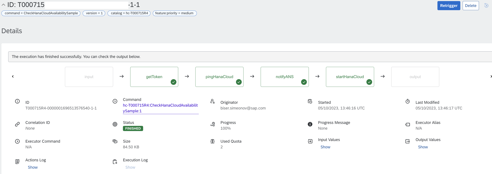

# Check HANA Cloud Availability

Table of Contents

* [Description](#description)
* [Requirements](#requirements)
* [How to use](#how-to-use)

## Description

There is a [list of monitoring metrics provided by HANA Cloud](https://help.sap.com/docs/HANA_CLOUD_DATABASE/f9c5015e72e04fffa14d7d4f7267d897/46e370ced3ef4d2bbd0ec2337df5f565.html) - it is a list of monitoring metrics provided by HANA Cloud which are exposed via the metrics service REST API. In order to validate whether or not HANA Cloud one or more instances are available, out of the different metrics returned by the API, you can check out the ping service metric `HDBAccessible`. The metric’s value is captured every 30 seconds – see below its definition as returned by the API itself:
```
"data": [
        {
            "resourceType": "hana-cloud-hdb",
            "name": "HDBAccessible",
            "type": "gauge",
            "unit": "",
            "dimensions": [],
            "description": "Ping check succeeded (value 1) or failed (value 0) for HDB",
            "interval": 30,
            "aggregates": [],
            "retention": 2592000
```

Therefore, there should be in place an Automation Pilot command scheduled to be executed on a specified time threshold whcih validates whether or not HANA Cloud DB is available.
This example is about the command in question that calls the HANA Cloud Metrics REST API ,  gets the datа from the parameter `HDBAccessible` and based on conditional checks within the SAP Automation Pilot can analyze the response and perform a recommended action (if needed). 

Since the date received from the [HANA Cloud Available Metrics API](https://help.sap.com/docs/HANA_CLOUD_DATABASE/f9c5015e72e04fffa14d7d4f7267d897/46e370ced3ef4d2bbd0ec2337df5f565.html) it is from type `gauge`, the Automation Pilot converts it into an array and applies a conditionl check so that in case the latest three pings are failed (value is "0") , a [custom event to the SAP Alert Notificaiton service is fired by the Automation Pilot](https://help.sap.com/docs/automation-pilot/automation-pilot/producing-custom-events) reulting in an email alert sent out to our Ops team by the Alert Notification service. 
Moreover, in parallel to the sending of the custom event to the Alert Notification service, in case the HANA Cloud is detected to be not accessible, the Automation Pilot will initiate automatically a remeditation commamnd - starting the HANA Cloud. 

A use case diagram is available below: 


## Requirements

To use this example you'll need the following:

* SAP HANA Cloud database
* User with database access

Check out the following resources for more information:

* [Deploy SAP HANA Cloud](https://developers.sap.com/tutorials/hana-cloud-deploying.html)
* [Create Users and Manage Roles and Privileges](https://developers.sap.com/tutorials/hana-cloud-mission-trial-4.html)
* [Overview of Available Metrics](https://help.sap.com/docs/HANA_CLOUD_DATABASE/f9c5015e72e04fffa14d7d4f7267d897/46e370ced3ef4d2bbd0ec2337df5f565.html)
* [Integrate your Automaton Pilot instance to the Alert Notification service](https://help.sap.com/docs/automation-pilot/automation-pilot/integrate-with-sap-alert-notification-service-for-sap-btp)

## How to use

Import the content of [examples catalog](catalog.json) in your Automation Pilot tenant. Navigate to the *CheckHanaCloudAvailabilitySample* command and trigger it.

You'll need to provide values for the following **input keys**:

* _AnsPassword_ - Password / Client Secret ID to the ANS Producer API, available in your ANS service key file, look for.
* _AnsUrl_ - URL to the Alert Notification service Producer API, available in your ANS service key file, look for "url".
* _AnsUser_ - User used to authenticate to the the ANS Producer API, available in your ANS service key file, look for "client_id"
* _BtpTechnicalUserPassword_ - Password for the SAP BTP technical user you have created and currently maintain active.
* _BtpTechnicalUserUsername_ - Username for the SAP BTP technical user you have created and currently maintain active.
* _hanaClientID_ - HANA Client ID - available in your HANA Cloud service key file, look for "clientid".
* _hanaClientSecret_ - HANA Client Secret ID - available in your HANA Cloud service key file, look for "client secret".
* _hanaClientTokenURL_ - The URL needed to be called in order to generate a token to access your HANA Cloud instance. The URL is build as it follows: in the HANA Cloud service key file look for the specified "url" + add to it `/oauth/token?grant_type=client_credentials`.
* _hanaCloudRegion_ - The region where your SAP BTP sub-account is located at, e.g. "cf-eu10".
* _hanaCloudResourceGroup_ - The name of the CF Space where your HANA Cloud is located at, e.g. "dev", "prod", etc.
* _hanaCloudResourceName_ - The exact name for your HANA Cloud instance, e.g. "hanaDemo", "hanaProd", etc.
* _hanaCloudSubAccount_ - The exact "Org Name" for your SAP BTP sub-account where your HANA Cloud instance is located at.
* _hanaServiceInstance_ - The Instance ID for your HANA Cloud - it can be found from the provisioned service in BTP Cockpit, look for "Instance ID".

You also can look now into the prepared outputs (no need provide values for them but it is important to understand what data is retured as command's output):
* checkPing - The entire response for the metric "HDBAccessible" returned by HANA Cloud Metrics Service REST API.
* isHanaCloudAvailable - Check on whether or not the HANA Cloud instance is available, where: "true" = HANA Cloud is available; "false" = HANA Cloud is not available.
* resultHanaStart - Check on whether or not the HANA Cloud instance has been started successfully, where: "true" = HANA Cloud has been started ; "false" = HANA Cloud was not started'.


After triggering the command there will be two possible options: 

**Option A:** HANA Cloud is accessible - the command will be completed succesfully and you can see the following output, meaning HANA Cloud is accessible and the command for starting HANA Cloud has not been triggered. 




.. where the HANA Cloud instance is up and running (see screrenshot from the SAP HANA Cloud Central)


**Option B:** HANA Cloud is NOT accessible - the command will be completed succesfully and you can see the following output, meaning HANA Cloud is NOT accessible and the command for starting HANA Cloud has BEEN triggered.

.. so that the starting of the HANA Cloud instance has been triggered by SAP Automation Pilot


.. where the HANA Cloud instance at its initial state is not running and after triggering the command has been started (see screrenshots from the SAP HANA Cloud Central)


The command outputs are visualized underneath: 


:information_source: **How SAP Automation Pilot finds out if your HANA Cloud is available** - as already described, SAP Automation Pilot calls [HANA Cloud Available Metrics API](https://help.sap.com/docs/HANA_CLOUD_DATABASE/f9c5015e72e04fffa14d7d4f7267d897/46e370ced3ef4d2bbd0ec2337df5f565.html), gets the response for the metric  it is from type `gauge`, the Automation Pilot converts it into an array and applies a conditionl check so that in case the latest three pings are failed (value is "0") - then it considers the HANA Cloud instance is not accessible. This conditional check is implemented in both executions `notifyANS` and `startHanaCloud`. The check itselef is the following one and of course - it can be modified to fit better your needs: 
```$(.pingHanaCloud.output.body | toArray | [.[0] ,.[1] ,.[2]] | any(.value == 1) ) equals false```

:information_source: **Alerting via email, slack message, Jira ticket or other channel using SAP Alert Notification service** - another important aspect within the command is the alerting. It's important to receive notifications (in the form of email, slack message, Jira ticket or other channel) whenever the command *CheckHanaCloudAvailabilitySample* detects that the HANA Cloud instance is not available. This could be easily achieved with the help of SAP Alert Notification and its integration to the SAP Automation Pilot. More information can be found [here](https://help.sap.com/docs/AUTOMATION_PILOT/de3900c419f5492a8802274c17e07049/e75533639c6d4193aa8a7e7420c25f8c.html).

In the sample command provided, in case SAP Automation Pilot detects that HANA Cloud instance is not available, it will be ingesting a custom event into the SAP Alert Notification service" 
```
{ "eventType": "FailedHCAvailabilityCheck", "severity": "ERROR", "category": "ALERT", "subject": "Failed HANA Cloud Availability Check $(nowMillis | toDate("yyyy-MM-dd"))", "body": "The availability check for HANA Cloud with Service Instance ID $(.execution.input.hanaServiceInstance) has failed. Now the Automation Pilot proceeds with an automated START for this HANA Cloud instance.", "resource": { "resourceName": "hana", "resourceType": "database" } }
```
See below where the code for the custom event is located within the sample command: 


Once the custom event gets received within the SAP Alert Notification service you can create the needed "[Condition](https://help.sap.com/docs/alert-notification/sap-alert-notification-for-sap-btp/managing-conditions)", "[Action](https://help.sap.com/docs/alert-notification/sap-alert-notification-for-sap-btp/managing-actions)" and "[Subscription](https://help.sap.com/docs/alert-notification/sap-alert-notification-for-sap-btp/managing-subscriptions)", so that the Alert Notificaiton service can filter the event out and trigger the desired action. 
In the screenshot below you can find out a sample alert email that has been triggered in case the HANA Cloud instance is not accessible. Of course, the email can be customized , see [Email Action Type](https://help.sap.com/docs/alert-notification/sap-alert-notification-for-sap-btp/email-action-type#email-action). You also can pick up one or more actions that can be triggered by the Alert Notification service. 

