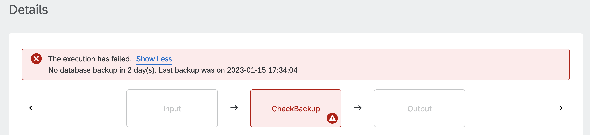

# Check HANA Cloud Database Backup

Table of Contents

* [Description](#description)
* [Requirements](#requirements)
* [How to use](#how-to-use)

## Description

A full backup of your SAP HANA Cloud database is [taken automatically](https://help.sap.com/docs/HANA_CLOUD/9ae9104a46f74a6583ce5182e7fb20cb/89d71f01daca4ecaaa069d6a060167f5.html) once per day. Nevertheless, as a save measure we can create an Automation Pilot command which verifies that there was a recent backup of the database.

This example command performs an SQL query to find the most recent backup by pulling The pulling data from the [M_BACKUP_CATALOG system view](https://help.sap.com/docs/SAP_HANA_PLATFORM/4fe29514fd584807ac9f2a04f6754767/20a8437d7519101495a3fa7ad9961cf6.html). If the last successful backup is older than the specified threshold, the execution fails with an error message:

## Requirements

To use this example you'll need the following:

* SAP HANA Cloud database
* Database user
* JDBC URL of the following format: `jdbc:sap://<endpoint>:<port>`
* Allowed connections from Automation Pilot to your HANA Cloud database. Use [this procedure](https://help.sap.com/docs/HANA_SERVICE_CF/cc53ad464a57404b8d453bbadbc81ceb/71eb651f84274a0cb2f2b4380df91724.html) to add the NAT IPs of the [relevant Automation Pilot region](https://help.sap.com/docs/AUTOMATION_PILOT/de3900c419f5492a8802274c17e07049/4536e41c57aa442095ccbac977965f26.html#regions).

Check out the following resources for more information:

* [Deploy SAP HANA Cloud](https://developers.sap.com/tutorials/hana-cloud-deploying.html)
* [Create Users and Manage Roles and Privileges](https://developers.sap.com/tutorials/hana-cloud-mission-trial-4.html)
* [Connect to the SAP HANA Database in SAP HANA Cloud via JDBC](https://help.sap.com/docs/HANA_CLOUD/db19c7071e5f4101837e23f06e576495/030a162d380b4ec0bc6a284954c8256d.html)

## How to use

Import the content of [examples catalog](catalog.json) in your Automation Pilot tenant. Navigate to the *CheckHanaCloudBackup* command and trigger it.

You'll need to provide values for the following input keys:

* *connectionUrl* - JDBC connection URL for the database
* *user* - Name of a database user
* *password* - Password for the specified database user
* *ageThreshold* - Backup age threshold in days. Defaults to 3 days

This command is most useful when executed every day. Automation Pilot allows executions to be automatically triggered on regular intervals - hourly, daily, weekly, monthly or yearly. You can find more details in the [documentation](https://help.sap.com/docs/AUTOMATION_PILOT/de3900c419f5492a8802274c17e07049/96863a2380d24ba4bab0145bbd78e411.html).

Another important aspect is alerting. It's important to receive notifications (in the form of email, slack message, Jira ticket or other) whenever the *CheckHanaCloudBackup* command fails to find a recent backup. This could be easily achieved with the help of SAP Alert Notification. More information can be found [here](https://help.sap.com/docs/AUTOMATION_PILOT/de3900c419f5492a8802274c17e07049/e75533639c6d4193aa8a7e7420c25f8c.html).
