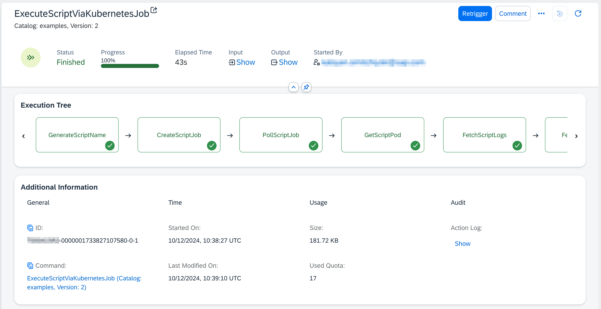
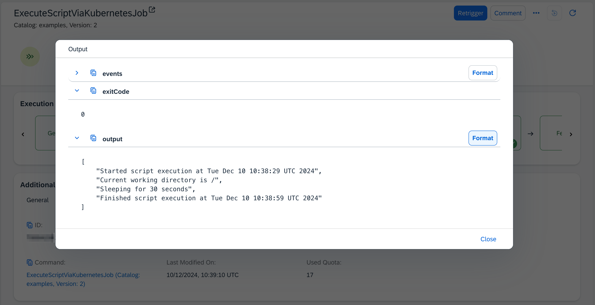

# Execute Script Via Kubernetes Job

Table of Contents

* [Description](#description)
* [Requirements](#requirements)
* [How to use](#how-to-use)
* [Setup Pull Secret](#setup-pull-secret)

## Description

This example demonstrates how to execute a custom bash script within a Kubernetes Job in a customer-owned Kubernetes cluster (e.g., via [Kyma](https://help.sap.com/docs/btp/sap-business-technology-platform/kyma-environment) or from other Cloud Providers). The provided `ExecuteScript` command in SAP Automation Pilot has concrete limitations in terms of resources and timeout. By using a Kubernetes Job, you can leverage the resources of your own Kubernetes cluster and configure the job to meet your specific requirements.

### Key Features

* **Resource Management**: Utilize the resources of your Kubernetes cluster to execute scripts that require more CPU, memory, or storage than what is available in the default `ExecuteScript` command.
* **Custom Images**: Use your own container images from private registries to tailor the execution environment to your needs.
* **Timeout Configuration**: Set higher timeouts for script execution, ensuring that long-running scripts can complete without being interrupted.
* **Event Logging**: Retrieve all Kubernetes events related to the script execution for better debugging and monitoring.
* **Data Security**: All data related to the execution of the script, including the script itself, parameters, and environment variables, is stored in a Kubernetes secret.

### Use Cases

* **Complex Scripts**: Execute complex scripts that require significant computational resources or have long execution times.
* **Custom Dependencies**: Run scripts that depend on specific tools or libraries available in custom container images.
* **Scalability**: Execute large number of scripts in parallel in your Kubernetes cluster.

## Requirements

To use this example you'll need the following:

* **Kubernetes Cluster**: A Kubernetes cluster where the job will be executed.
* **Kubeconfig**: Credentials for accessing the Kubernetes cluster.
* **Container Image**: A container image that provides the environment where the script will be executed. You can also use images from public registries (e.g., `ubuntu:24.04`).
* **Namespace**: The Kubernetes namespace where the job will be created.
* **Image Pull Secret** (optional): A Kubernetes secret for pulling private container images.

## How to use

1. **Import the Example**:

* Copy the content of the [catalog.json](./catalog.json) file.
* Go to your SAP Automation Pilot tenant and navigate to `My Catalogs`.
* Click on `Import` in the upper right corner.
* Paste the catalog's content and import it.

2. **Trigger the Command Manually**:

* Navigate to the `ExecuteScriptViaKubernetesJob` command in your SAP Automation Pilot tenant.
* Click on the *Trigger* button after getting familiar with the command.
* Provide values for the following input keys:
  * `kubeconfig`: Credentials for the specified Kubernetes cluster.
  * `namespace`: Namespace where the script will be executed.
  * `image`: Container image to be used for executing the script, e.g., *ubuntu:24.04*
  * `imagePullSecretName` (optional): Name of the image pull secret to use when the image is sourced from a private registry.
  * `script`: Script to be executed (base64 encoded).
  * `environment` (optional): Environment variables available during script execution.
  * `parameters` (optional): Parameters that will be passed to the script in the specified order.
  * `stdin` (optional): Sensitive data passed to the script's standard input.
  * `timeout` (optional): Timeout of the script in seconds (default is 30).
  * `outputLines` (optional): Number of script output lines to be returned (default is 1000).

3. **Monitor the Execution**:

* The command will create a Kubernetes Job to execute the script, wait for it to finish, and at the end will retrieve the exit code, the script output, and all related Kubernetes events.
* After the execution finishes, you can see the script output, exit code, and related events:

:information_source: The Kubernetes Job will be automatically cleaned up after execution, ensuring that no resources are left behind. The job is configured with [ttlSecondsAfterFinished](https://kubernetes.io/docs/concepts/workloads/controllers/ttlafterfinished/) which automatically deletes the job after 3 minutes.

:information_source: The Kubernetes secret created for the script execution will also be automatically deleted with a status listener when the execution enters a terminal state (FINISHED, ABORTED, or SUSPENDED).

## Setup Pull Secret

If you need to pull a container image from a private registry, you can set up a pull secret using the `CreateK8sImagePullSecret` command provided in the example.

1. **Trigger the Command Manually**:

* Navigate to the `CreateK8sImagePullSecret` command in your SAP Automation Pilot tenant.
* Click on the *Trigger* button after getting familiar with the command.
* Provide values for the following input keys:
  * `secretName`: Name of the secret to be created.
  * `namespace`: Namespace where the secret will be created.
  * `dockerconfig`: Credentials for the private container image registry in the format described [here](https://kubernetes.io/docs/concepts/containers/images/#config-json).
  * `kubeconfig`: Credentials for the specified Kubernetes cluster.

2. **Use the Pull Secret**:

* When triggering the `ExecuteScriptViaKubernetesJob` command, provide the name of the created pull secret in the `imagePullSecretName` input key.

This will ensure that the Kubernetes job can pull the container image from the private registry using the specified pull secret.
