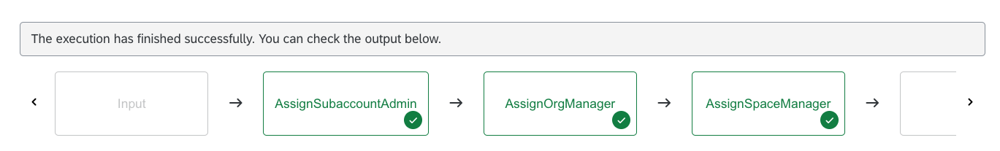
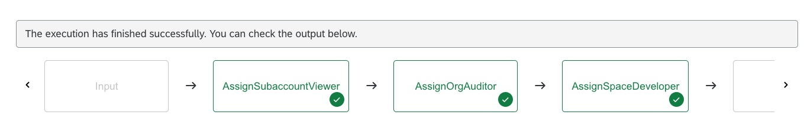
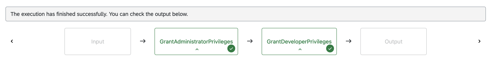
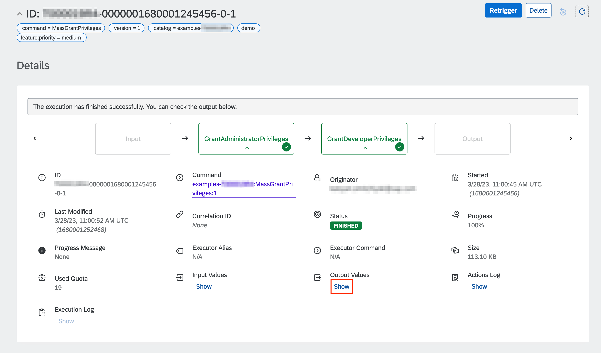
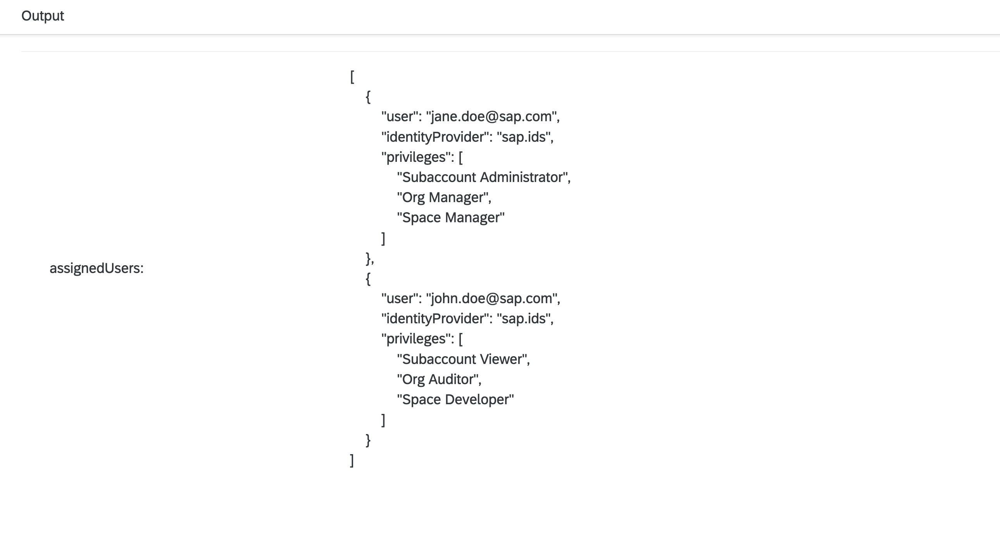

# Grant Privileges on BTP Subaccount and CF Level

Table of Contents

* [Description](#description)
* [Requirements](#requirements)
* [How to use](#how-to-use)

## Description

As a continuation of the [Setup Cloud Foundry BTP Environment](../prepare-btp-environment/) example, we'll explore the capabilities of SAP Automation Pilot manage users and their permissions on subacount, organization and space level.

This example provides two commands which utilize the **SAP Authorization and Trust Management Service (xsuaa-sapcp)** and **Cloud Foundry (cf-sapcp)** provides catalogs.

**GrantAdministratorPrivileges** performs the following actions on the target user:

* Assigns *Subaccount Administrator* role collection
* Assigns *Org Manager* role
* Assigns *Space Manager* role

**GrantDeveloperPrivileges** performs the following actions on the target user:

* Assigns *Subaccount Viewer* role collection
* Assigns *Org Auditor* role
* Assigns *Space Developer* role

**MassGrantPrivileges** builds upon the above commands and executes them on multiple users at once.

:information_source: Make sure to check the other examples in the [BTP Provisioning](../README.md#btp-provisioning) section.

## Requirements

To use this example you'll need the following:

* BTP subaccount
* Configured Cloud Foundry environment
* Instance of [SAP Authorization and Trust Management Service](https://discovery-center.cloud.sap/serviceCatalog/authorization-and-trust-management-service?region=all) with plan *apiaccess* and a service key/binding with default configurations
* One or more custom identity providers

:warning: If you are planning to use SAP Universal ID, please keep [SAP Note 3085908](https://launchpad.support.sap.com/#/notes/3085908) in mind

Check out the following resources for more information:

* [Example: Create and Configure BTP Subaccount](../prepare-btp-subaccount/)
* [Example: Setup Cloud Foundry BTP Environment](../prepare-btp-environment/)
* [Getting Started in the Cloud Foundry Environment](https://help.sap.com/docs/btp/sap-business-technology-platform/getting-started-in-cloud-foundry-environment)
* [SAP Authorization and Trust Management Service](https://help.sap.com/docs/CP_AUTHORIZ_TRUST_MNG)
* [Access Administration Using APIs of the SAP Authorization and Trust Management Service](https://help.sap.com/docs/btp/sap-business-technology-platform/access-administration-using-apis-of-sap-authorization-and-trust-management-service)
* [Trust and Federation with Identity Providers](https://help.sap.com/docs/btp/sap-business-technology-platform/trust-and-federation-with-identity-providers)

## How to use

Import the content of [examples catalog](catalog.json) in your Automation Pilot tenant. Navigate to the *MassGrantPrivileges* command and trigger it.

You'll need to provide values for the following input keys:

* *region* - Technical name of your SAP BTP region, e.g. cf-eu10, cf-us20
* *org* - Name of your Cloud Foundry organization
* *space* - Name of your Cloud Foundry space
* *user* - Email or ID of your technical user
* *password* - Password of your technical user
* *identityProvider* - Optional: origin key of your identity provider. Defaults to sap.ids
* *serviceKey* - Service key for *SAP Authorization and Trust Management Service* for *apiaccess* plan
* *developers* - Email address of the target users which should be granted developer privileges
* *administrators* - Email address of the target users which should be granted administrator privileges
* *targetIdentityProvider* - Optional: origin key of the target user's identity provider. Defaults to sap.ids

After the successful execution of the command, you can check which users were reassigned to another identity provider:

To grant privielges to a single user, navigate to the *GrantAdministratorPrivileges* or *GrantDeveloperPrivileges* commands and trigger them.

You'll need to provide values for the following input keys:

* *region* - Technical name of your SAP BTP region, e.g. cf-eu10, cf-us20
* *org* - Name of your Cloud Foundry organization
* *space* - Name of your Cloud Foundry space
* *user* - Email or ID of your technical user
* *password* - Password of your technical user
* *identityProvider* - Optional: origin key of your identity provider. Defaults to sap.ids
* *serviceKey* - Service key for *SAP Authorization and Trust Management Service* for *apiaccess* plan
* *targetUser* - user to whom the privileges will be granted
* *targetIdentityProvider* - Optional: origin key of the target user's identity provider. Defaults to sap.ids

:information_source: You can verify the result of your executions by navigating to your BTP subaccount and choosing **Security -> Users**.
