# SAP HANA Cloud Lifecycle Management

Table of Contents

* [Description](#description)
* [Requirements](#requirements)
* [Available Commands](#available-commands)
* [How to use](#how-to-use)

## Description

This catalog provides a comprehensive set of lifecycle management commands for SAP HANA Cloud instances in the *Other Environment* (subaccount level) using Service Manager. These commands enable you to automate all aspects of HANA Cloud database management, including:

* **Instance Management**: Create, delete, start, stop, and recover HANA Cloud instances
* **Configuration**: Update instance size, allowed connections, and backup settings
* **Upgrades & Updates**: Upgrade instances to new versions and enable capabilities
* **Snapshots**: Create, list, delete, and revert to snapshots
* **Backup & Recovery**: Manage backups and recover instances from backup
* **Extended Compute Nodes (ECN)**: Create, update, list, and delete ECNs
* **System Operations**: Copy instances, install plugins, and manage takeover operations

All commands in this catalog use the SAP Service Manager API to manage HANA Cloud instances, providing a consistent and automated approach to database lifecycle management.

## Requirements

To use this example you'll need the following:

* HANA Cloud database in the *Other environment* (subaccount level)
* Instance of [SAP Service Manager](https://help.sap.com/docs/service-manager/sap-service-manager/sap-service-manager) with plan *subaccount-admin* and a service key

Check out the following resources for more information:

* [SAP Service Manager Documentation](https://help.sap.com/docs/service-manager/sap-service-manager/sap-service-manager)
* [HANA Cloud Administration Guide](https://help.sap.com/docs/HANA_CLOUD)

## Available Commands

This catalog includes 31 commands for comprehensive HANA Cloud lifecycle management:

### Instance Lifecycle Management

| Command | Description |
|---------|-------------|
| **CreateHanaCloudInstance** | Provisions a new SAP HANA Cloud Database instance with specified configuration including memory, storage, and network access settings |
| **DeleteHanaCloudInstance** | Permanently deletes a HANA Cloud instance and all its data (irreversible, backups retained per policy) |
| **StartHanaCloudInstance** | Starts a stopped HANA Cloud instance (typically takes 5-10 minutes) |
| **StopHanaCloudInstance** | Gracefully stops a running HANA Cloud instance to reduce costs while preserving data (typically takes 2-5 minutes) |
| **RestartHanaCloudInstance** | Restarts a HANA Cloud instance by stopping and starting it (useful for applying changes or troubleshooting, takes 10-15 minutes) |
| **GetHanaCloudInstance** | Retrieves detailed information about a HANA Cloud instance including status, configuration, labels, and connection details |
| **ListHanaCloudInstances** | Retrieves a list of all HANA Cloud instances in the subaccount with their current status and metadata |
| **CopyHanaCloudInstance** | Creates a copy of a HANA Cloud instance at a given point in time to a new instance (supports same or cross-subaccount) |

### Backup & Recovery

| Command | Description |
|---------|-------------|
| **RecoverHanaCloudInstance** | Restores a HANA Cloud instance to a specific point in time using available backups and transaction logs |
| **RecreateHanaCloudInstanceFromBackup** | Recreates a HANA Cloud instance from backup for disaster recovery (same or different availability zone) |
| **StartHanaCloudInstanceTakeover** | Initiates failover to a replica (supports synchronous replication or disaster recovery takeover) |
| **UpdateHanaCloudBackupSettings** | Updates the backup retention policy (affects storage costs and point-in-time recovery capabilities) |

### Snapshot Management

| Command | Description |
|---------|-------------|
| **CreateHanaCloudSnapshot** | Creates a snapshot for version rollback (only one snapshot allowed per instance, auto-deleted after 14 days) |
| **ListHanaCloudSnapshots** | Retrieves all available storage snapshots with size, version, ID, and timestamp information |
| **DeleteHanaCloudSnapshot** | Deletes a specific snapshot before automatic expiration |
| **DeleteOldestHanaCloudSnapshot** | Automatically identifies and deletes the oldest snapshot by creation timestamp |
| **RevertHanaCloudToSnapshot** | Rolls back instance to a previous snapshot (requires downtime, typically 20-40 minutes, irreversible) |

### Instance Configuration

| Command | Description |
|---------|-------------|
| **UpdateHanaCloudInstanceSize** | Modifies compute and storage resources (memory/vCPU changes require restart, storage can only increase) |
| **UpdateHanaCloudInstanceAllowedConnections** | Configures IP filter rules controlling which addresses can connect (immediate effect, no restart) |
| **EnableHanaCloudConnectivityProxy** | Enables/disables Cloud Connector connectivity allowing on-premise SAP HANA to connect to cloud and replicate data |
| **UpdateHanaCloudBackupSettings** | Updates the backup retention policy (affects storage costs and point-in-time recovery capabilities) |
| **EnableHanaCloudCapabilities** | Enables/disables capabilities: scriptserver, docstore, dpserver, PAL, NLP, triplestore (some require +16 GB memory) |

### Upgrades & Plugins

| Command | Description |
|---------|-------------|
| **UpgradeHanaCloudInstance** | Upgrades instance to a newer version within release cycle and track (cannot downgrade, patches available for 7 months) |
| **ListHanaCloudAvailableUpgradeVersions** | Retrieves current version and available upgrade versions with maintenance status |
| **InstallHanaCloudPlugins** | Installs plugins to extend database functionality with additional capabilities |
| **ListHanaCloudPlugins** | Retrieves all installed plugins with their name and status information |

### Elastic Compute Nodes (ECN)

| Command | Description |
|---------|-------------|
| **CreateHanaCloudECN** | Creates a single Elastic Compute Node to provide additional compute resources for query processing |
| **CreateMultipleHanaCloudECNs** | Creates multiple ECNs in a single operation for scaled query processing capacity |
| **UpdateHanaCloudECN** | Updates ECN configuration (vCPU, memory 32GB-6TB in 15GB increments, storage) |
| **ListHanaCloudECNs** | Retrieves all ECNs with their vCPU, memory, and storage configuration details |
| **DeleteHanaCloudECN** | Deletes a specific ECN by name while keeping other ECNs active |
| **DeleteAllHanaCloudECNs** | Deletes all ECNs from an instance (use with caution, cannot be undone) |

## How to use

Import the content of [examples catalog](catalog.json) in your Automation Pilot tenant. Navigate to the desired command and trigger it.

### Common Input Parameters

Most commands in this catalog require the following input parameters:

* **serviceKey** - Service key to the SAP Service Manager with plan *subaccount-admin*. This is a sensitive object containing authentication credentials
* **instanceId** - The unique identifier (GUID) or display name of the HANA Cloud instance

### Example: Starting a HANA Cloud Instance

To start a HANA Cloud instance, navigate to the *StartHanaCloudInstance* command and provide:

* **serviceKey** - Your Service Manager service key (object)
* **instanceId** - The ID or name of your HANA Cloud instance
* **deadline** - Optional: Maximum time to wait for the operation to complete (in seconds)

### Example: Creating a Snapshot

To create a snapshot of your HANA Cloud instance, use the *CreateHanaCloudSnapshot* command with:

* **serviceKey** - Your Service Manager service key (object)
* **instanceId** - The ID or name of your HANA Cloud instance

### Example: Copying a HANA Cloud Instance

To copy a HANA Cloud instance to a new instance at a specific point in time, use the *CopyHanaCloudInstance* command with:

* **targetInstanceId** - The unique identifier (GUID) or display name of the target HANA Cloud instance that will receive the copy
* **sourceInstanceId** - The identifier of the source HANA Cloud instance (can be name or ID for same subaccount, must be GUID/UID for cross-subaccount)
* **targetTimestamp** - The point-in-time timestamp to restore data from (format: YYYY-MM-DD HH:MM:SS)
* **serviceKey** - Your Service Manager service key (object)
* **deadline** - Optional: Maximum time to wait for the operation to complete

:information_source: **Note**: Each command has specific input parameters tailored to its operation. Review the command details in the Automation Pilot UI for complete parameter documentation.
