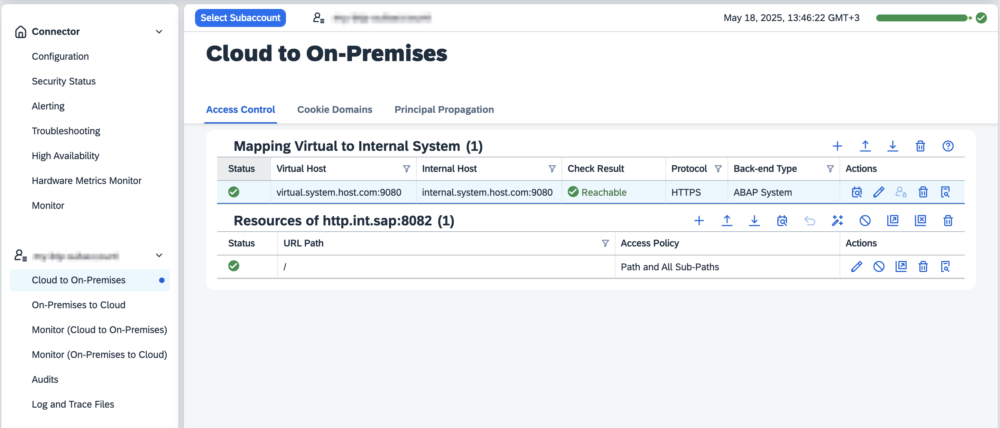
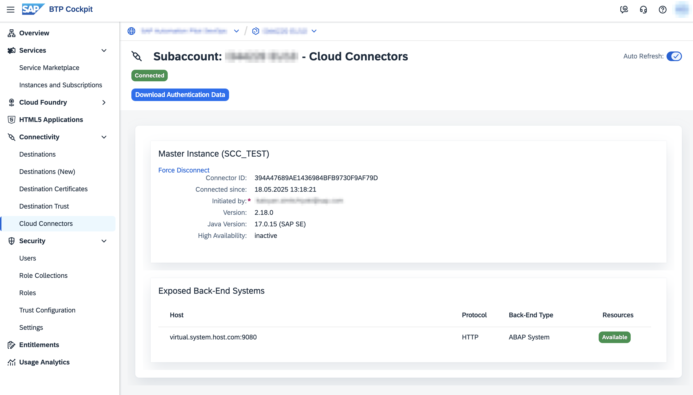
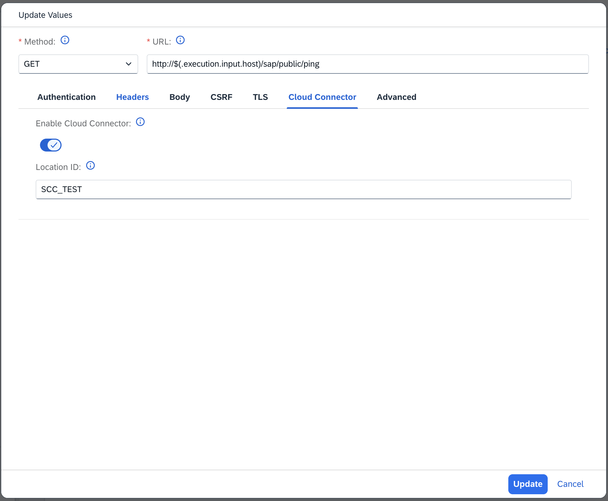
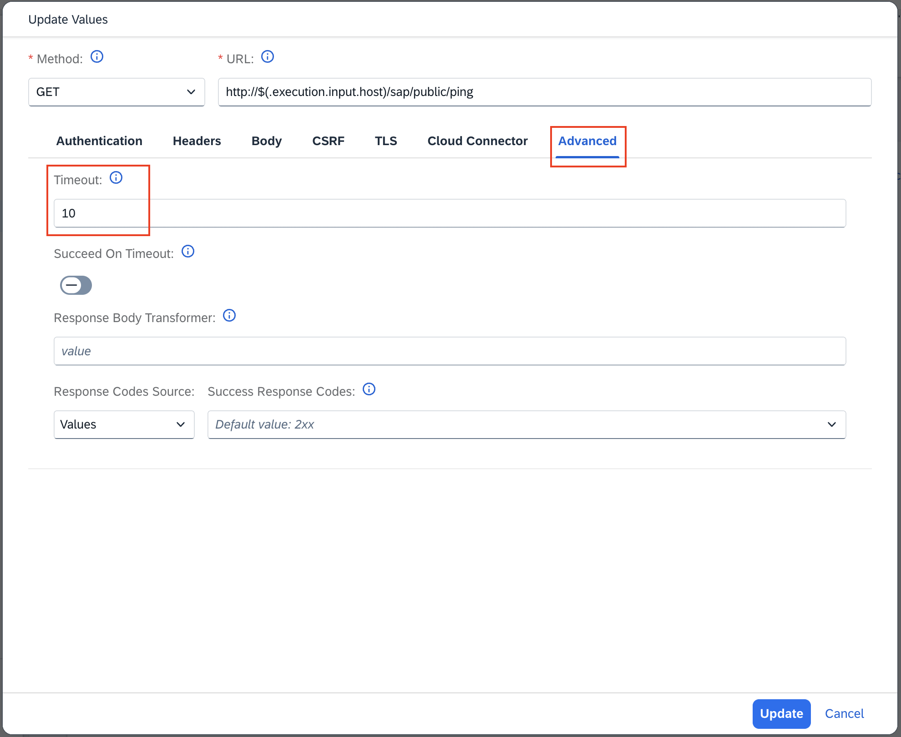
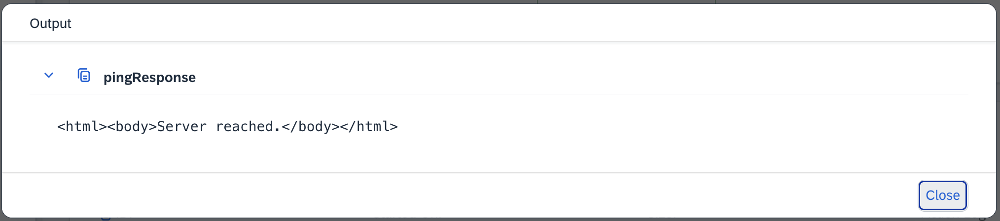

# HTTP Request via SAP Cloud Connector

Table of Contents

* [Description](#description)
* [Requirements](#requirements)
* [How to use](#how-to-use)
* [Expected result](#expected-result)

## Description

This example demonstrates how SAP Automation Pilot can perform HTTP requests not only to public endpoints, but also to internal endpoints exposed via the [SAP Cloud Connector](https://help.sap.com/docs/connectivity/sap-btp-connectivity-cf/cloud-connector). Any HTTP-based protocol is supported, including OData, REST, and SOAP.

The example targets the OData API ([ICM Ping Service](https://me.sap.com/notes/0002330899)) of a SAP Basis system, but you can use the same approach to access any HTTP endpoint—SAP or non-SAP—reachable through the Cloud Connector.

By leveraging the Cloud Connector, Automation Pilot can interact with systems that are not directly accessible from the public internet, enabling secure automation scenarios across hybrid landscapes.

## Requirements

To use this example you'll need the following:

* **SAP Automation Pilot Tenant**: Access to an SAP Automation Pilot tenant.
* **SAP Cloud Connector**: Connected to the same SAP BTP account as your Automation Pilot tenant.
* **Configured Cloud Connector Mapping**: The internal HTTP endpoint (e.g., SAP Basis system) must be exposed via the Cloud Connector and accessible using a virtual hostname and port.

### Cloud Connector Setup Steps

1. **Expose your system through the Cloud Connector**
   Assign a virtual host and port to your internal system in the Cloud Connector admin console. This virtual host will be used to send requests from BTP (e.g., Automation Pilot) to your system.

   

2. **Verify Cloud Connector connection in BTP**
   Once the Cloud Connector is successfully connected to your BTP subaccount and the system is exposed, you will see the Cloud Connector listed in your BTP subaccount cockpit.

   

3. **Send requests via Automation Pilot**
   In Automation Pilot, use the `HttpRequest` command with Cloud Connector enabled. Provide the Location ID of the Cloud Connector (or leave empty if not specified) and use the virtual host/port as the target. This is already demonstrated in the example command.

   

    **:information_source: Note:**
    When making HTTP requests via the Cloud Connector, it is recommended to increase the default timeout value for the request. Requests routed through the Cloud Connector may take longer to complete due to additional network hops and processing.

    
    *Example: Where to increase the timeout value in the command setup.*

## How to use

1. **Import the Example**:
   * Copy the content of the [catalog.json](./catalog.json) file.
   * Go to your SAP Automation Pilot tenant and navigate to `My Catalogs`.
   * Click on `Import` in the upper right corner.
   * Paste the catalog's content and import it.

2. **Trigger the Command**:
   * Use the `HttpCloudConnector` command.
   * Provide the `host` input (the virtual hostname and port as configured in the Cloud Connector).
   * Start the automation.

## Expected result

After execution, the command will perform an HTTP request to the ICM Ping service of the SAP Basis system (or any other HTTP endpoint you specify) via the Cloud Connector. The response from the endpoint will be returned as output, confirming connectivity and successful configuration.

