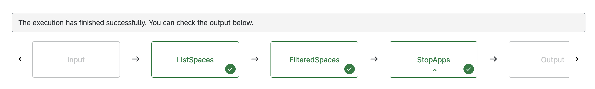
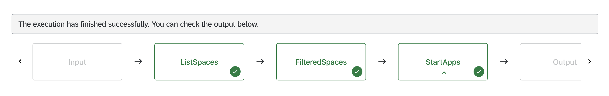
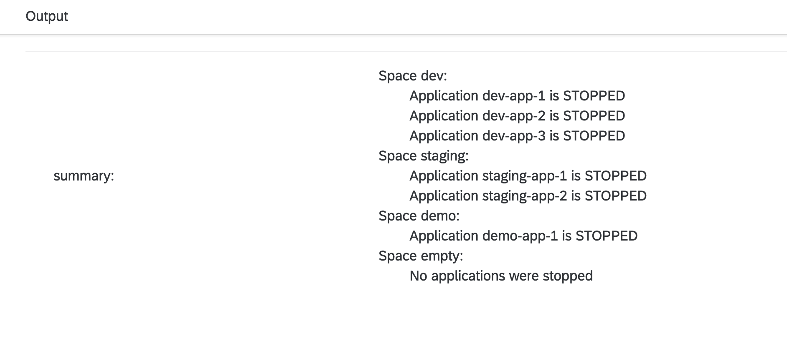

# Mass Stop/Start Cloud Foundry Apps

Table of Contents

* [Description](#description)
* [Requirements](#requirements)
* [How to use](#how-to-use)

## Description

If your BTP global account uses the consumption-based commercial model (such as CPEA or Pay-As-You-Go), Cloud Foundry applications are billed based on their usage. Therefore, you can reduce the monthly cost by stopping applications which are used only for testing and development purposes. With the help of SAP Automation Pilot, such resources can be automatically stopped outside of working hours and started again the next day. To find out more about the Cloud Foundry's billng costs, please feel free to consult [SAP BTP, Cloud Foundry Runtime](https://discovery-center.cloud.sap/serviceCatalog/cloud-foundry-runtime?tab=service_plan&region=all&commercialModel=cpea).

SAP Automation Pilot has the capabilities to perform mass operations on tens or even hundreds of Cloud Foundry applications, including stop, start or restart. In addition to this, these operations can be performed regularly with the [Scheduled Executions functionality](https://help.sap.com/docs/AUTOMATION_PILOT/de3900c419f5492a8802274c17e07049/96863a2380d24ba4bab0145bbd78e411.html).

This example includes a total of four commands. *MassStopCfAppsInSpace* and *MassStartCfAppsInSpace* dynamically find and stop/start all applications in the given space. Similarly, *MassStopCfAppsInOrg* and *MassStartCfAppsInOrg* do the same thing but on organization level - the applications across all spaces are collected and then started/stopped. In addition, it's possible to ignore certain spaces and do not perform any operations on them.

After a successful execution, each command outputs a short summary which is useful for transparency and traceability:

:warning: The commands within this example might cause downtime for a large amount of applications. Please make sure that you are not using them on productive systems.

## Requirements

To use this example you'll need the following:

* Multiple Cloud Foundry spaces with at least one application in each
* Technical user with **Space Developer** role in each space

:warning: If you are planning to use SAP Universal ID, please keep [SAP Note 3085908](https://launchpad.support.sap.com/#/notes/3085908) in mind

Check out the [documentation](https://help.sap.com/docs/btp/sap-business-technology-platform/administration-and-operations-in-cloud-foundry-environment) for more information.

## How to use

Import the content of [examples catalog](catalog.json) in your Automation Pilot tenant.
The examples includes four commands - *MassStopCfAppsInSpace*, *MassStartCfAppsInSpace*, *MassStopCfAppsInOrg* and *MassStartCfAppsInOrg*. Navigate to any of them and to trigger them.

You'll need to provide values for the following input keys:

* *region* - Technical name of your SAP BTP region, e.g. cf-eu10, cf-us20
* *subAccount* - Name of your Cloud Foundry organization
* *resourceGroup* - Name of your Cloud Foundry space
* *user* - Email or ID of your technical user
* *password* - Password of your technical user
* *identityProvider* - Optional: origin key of your identity provider. Defaults to sap.ids
* *excludedSpaces* - Technical names of the Cloud Foundry spaces in which the applications should not be started/stopped. Example value: `["prod-1", "prod-2"]`

:information_source: Most of the needed information is available in your subaccount's *Overview* page under *Cloud Foundry Environment*.

As mentioned before, Automation Pilot allows executions to be automatically triggered on regular intervals - hourly, daily, weekly, monthly or yearly. We can create two [Scheduled Executions](https://help.sap.com/docs/AUTOMATION_PILOT/de3900c419f5492a8802274c17e07049/96863a2380d24ba4bab0145bbd78e411.html) - one to stop all applications after working hours and another to start them up again on the next morning.

:information_source: Scheduled Executions use the UTC time zone.

Here are the some example schedule configurations:

* *MassStopCfAppsInOrg* - executed every weekday at 16:30 UTC
  * Schedule - Weekly on Monday, Tuesday, Wednesday, Thursday and Friday
  * Hours - 16
  * Minutes - 30

* *MassStartCfAppsInOrg* - every weekday at 06:30 UTC
  * Schedule - Weekly on Monday, Tuesday, Wednesday, Thursday and Friday
  * Hours - 6
  * Minutes - 30
