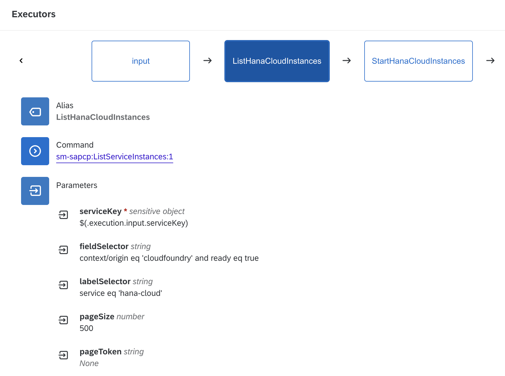

# Mass Stop/Start HANA Cloud Databases

Table of Contents

* [Description](#description)
* [Requirements](#requirements)
* [How to use](#how-to-use)

## Description

SAP HANA Cloud databases are billed based on their usage. When used for development or test purposes, it's often necessary to keep them running only during working hours. SAP Automation Pilot can help reduce costs by ensuring that your databases are only running when they are needed.

SAP Automation Pilot has the capabilities to perform mass operations on tens or even hundreds of HANA Cloud databases, including stop, start or restart. In addition to this, these operations can be performed regularly with the [Scheduled Executions functionality](https://help.sap.com/docs/AUTOMATION_PILOT/de3900c419f5492a8802274c17e07049/96863a2380d24ba4bab0145bbd78e411.html).

This example includes two commands - *MassStopHanaCloudInstances* and *MassStartHanaCloudInstances*. They begin by querying all HANA Cloud databases across all Cloud Foundry spaces in your BTP account. After that, they either start or stop each instance in parallel.

To collect all databases, we utilize the *ListServiceInstances* command which is part of the *SAP Service Manager* catalog. The example assumes that all HANA Cloud service instances are labeled with the *service: hana-cloud*. This is necessary to identity them among other service instances that you might have in your spaces. This logic can easily be changed by modifying the *ListHanaCloudInstances* step in the example commands. Please also check [this documentation page](https://help.sap.com/docs/service-manager/sap-service-manager/filtering-parameters-and-operators) for more information on how to use the filter queries.

:warning: The commands in this example might cause downtime for a large amount of databases. Please make sure that you are not using them on productive systems.
## Requirements

To use this example you'll need the following:

* One or more HANA Cloud databases in the Cloud Foundry environment
* Instance of [SAP Service Manager](https://help.sap.com/docs/service-manager/sap-service-manager/sap-service-manager) with plan *subaccount-admin* and a service key/bindin with default configurations.
* Platform user with *Space Developer* role in the spaces where the databases reside

:warning: If you are planning to use SAP Universal ID, please keep [SAP Note 3085908](https://launchpad.support.sap.com/#/notes/3085908) in mind

Check out the following resources for more information:

* [Deploy SAP HANA Cloud](https://developers.sap.com/tutorials/hana-cloud-deploying.html)
* [Create Users and Manage Roles and Privileges](https://developers.sap.com/tutorials/hana-cloud-mission-trial-4.html)
* [Creating Service Instances in Other Environments](https://help.sap.com/docs/service-manager/sap-service-manager/creating-instances-in-other-environments)
* [Creating Service Bindings in Other Environments](https://help.sap.com/docs/service-manager/sap-service-manager/creating-service-bindings-in-other-environments)

## How to use

Import the content of [examples catalog](catalog.json) in your Automation Pilot tenant.
The examples includes two commands - *MassStopHanaCloudInstances* and *MassStartHanaCloudInstances*. Navigate to any of them and to trigger them.

You'll need to provide values for the following input keys:

* *serviceKey* - Service Key for SAP Service Manager
* *user* - Email or ID of your technical user
* *password* - Password of your technical user
* *identityProvider* - Optional: origin key of your identity provider. Defaults to sap.ids

As mentioned before, Automation Pilot allows executions to be automatically triggered on regular intervals - hourly, daily, weekly, monthly or yearly. We can create two [Scheduled Executions](https://help.sap.com/docs/AUTOMATION_PILOT/de3900c419f5492a8802274c17e07049/96863a2380d24ba4bab0145bbd78e411.html) - one to stop all databases after working hours and another to start them up again on the next morning.

Here are the some example schedule configurations:

* *MassStopHanaCloudInstances* - executed every weekday at 16:30 UTC
  * Schedule - Weekly on Monday, Tuesday, Wednesday, Thursday and Friday
  * Hours - 16
  * Minutes - 30
* *MassStartHanaCloudInstances* - every weekday at 06:30 UTC
  * Schedule - Weekly on Monday, Tuesday, Wednesday, Thursday and Friday
  * Hours - 6
  * Minutes - 30

Another important aspect is alerting. It's important to receive notifications (in the form of email, slack message, Jira ticket or other) whenever the commands fail. This could be easily achieved with the help of SAP Alert Notification. More information can be found [here](https://help.sap.com/docs/AUTOMATION_PILOT/de3900c419f5492a8802274c17e07049/e75533639c6d4193aa8a7e7420c25f8c.html).
