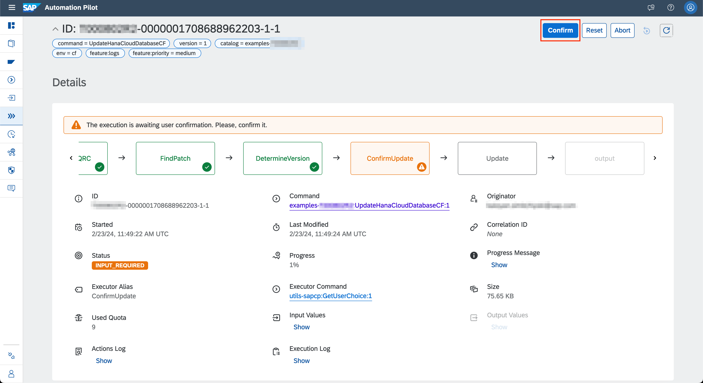
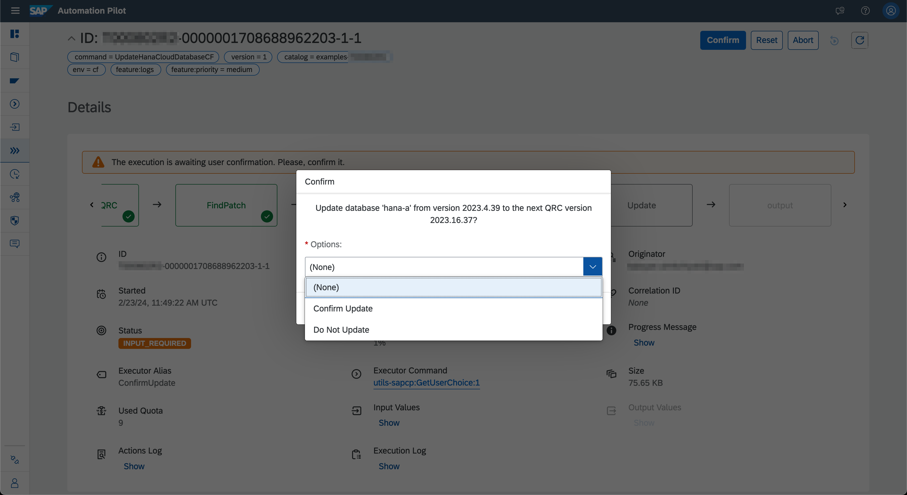
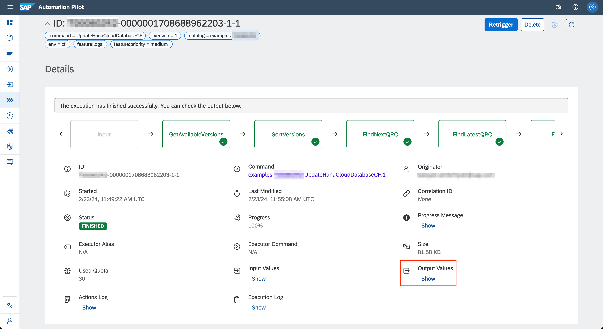
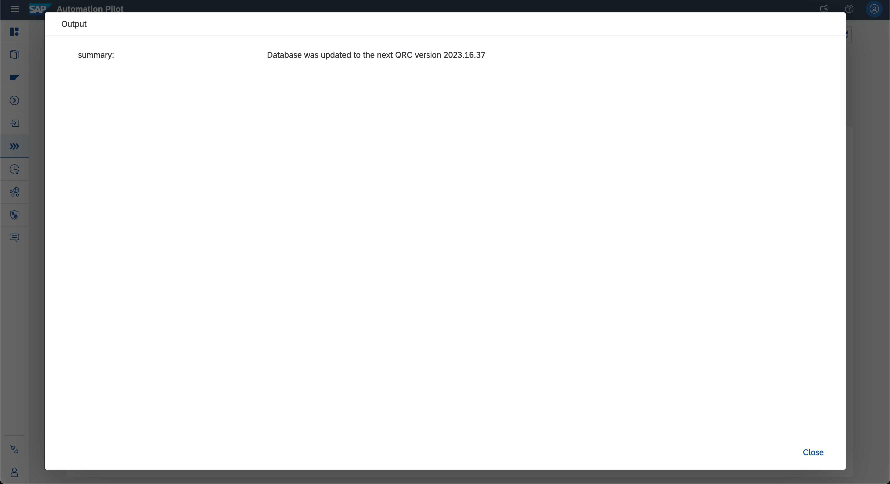
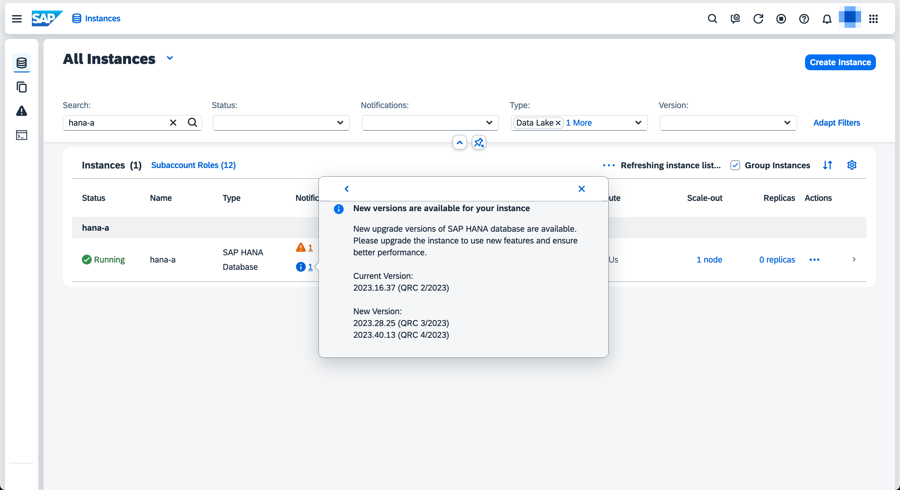

# Patch Update of HANA Cloud Database

Table of Contents

* [Description](#description)
* [Requirements](#requirements)
* [How to use](#how-to-use)
* [Expected result](#expected-result)

## Description

Every version of the SAP HANA Cloud database offers patches for up to seven months after its initial release. They contain bug fixes, security updates, and other important improvements.

Keeping your HANA Cloud database up to date is one of the most important things that you can do to maintain its security and reliability. However, patch updates aren't applied automatically by default - customers are expected to perform these updates manually.

SAP Automation Pilot can be used to fully automate the whole patching process. The command provided in this example performs the following steps:

* Checks if there's an available patch update.
* (Optionally) Pauses and waits for explicit confirmation before performing the update.
* Performs an update to the available patch version.
* If no new patch version is available, the execution finishes without doing any more work.

By default, applying a patch requires the database to be restarted, which causes downtime. Because of this, the command pauses before the actual update until an explicit confirmation. If downtime isn't a concern or the database is configured to perform updates without a restart, the confirmation can be disabled. More information can be found on this page: [Upgrading Without Restart](https://help.sap.com/docs/HANA_CLOUD/9ae9104a46f74a6583ce5182e7fb20cb/c26e42e6a7a4411191441c8d48fd9b11.html)

## Requirements

To use this example you'll need the following:

* HANA Cloud database in the Cloud Foundry environment
* Platform user with *Space Developer* role in the space where the database resides

:warning: If you are planning to use SAP Universal ID, please keep [SAP Note 3085908](https://launchpad.support.sap.com/#/notes/3085908) in mind

Check out the following resources for more information:

* [Deploy SAP HANA Cloud](https://developers.sap.com/tutorials/hana-cloud-deploying.html)
* [Create Users and Manage Roles and Privileges](https://developers.sap.com/tutorials/hana-cloud-mission-trial-4.html)

## How to use

Import the content of [examples catalog](catalog.json) in your Automation Pilot tenant. Navigate to the *PatchUpdateHanaCloudInstance* command and trigger it.

You'll need to provide values for the following input keys:

* *region* - Technical name of your SAP BTP region, e.g. cf-eu10, cf-us20, cf-eu10-004
* *subAccount* - Name of your Cloud Foundry organization
* *resourceGroup* - Name of your Cloud Foundry space
* *resourceName* - Name of your HANA Cloud service instance
* *user* - Email or ID of your technical user
* *password* - Password of your technical user
* *identityProvider* - Optional: origin key of your identity provider. Defaults to sap.ids
* *shouldConfirmBeforeUpdate* - Optional: whether to require confirmation before starting the update, if there's one available. Defaults to true

This command is most useful if executed regularly. Automation Pilot allows executions to be automatically triggered on regular intervals - hourly, daily, weekly, monthly or yearly. You can find more details in the [documentation](https://help.sap.com/docs/AUTOMATION_PILOT/de3900c419f5492a8802274c17e07049/96863a2380d24ba4bab0145bbd78e411.html).

Another important aspect is alerting. It's important to receive notifications (in the form of email, slack message, Jira ticket or other) whenever the *PatchUpdateHanaCloudInstance* command fails or is waiting for a confirmation before proceeding with the update. This could be easily achieved with the help of SAP Alert Notification. More information can be found [here](https://help.sap.com/docs/AUTOMATION_PILOT/de3900c419f5492a8802274c17e07049/e75533639c6d4193aa8a7e7420c25f8c.html).

## Expected result

Let's execute the *PatchUpdateHanaCloudInstance* command on a HANA Cloud database with an available patch version:

After finding that there's an available patch version, the execution halts:

:information_source: The update confirmation can be disabled by triggering the command with `shouldConfirmBeforeUpdate=false`. This way the update will be performed completely automatically.

Clicking on the *Confirm* button will present us with a dialog. We'll need to decide whether we want to continue with the update or abort it. For the sake of the demonstration, we'll confirm it:

The execution begins the update to latest patch version. It might take a while, depending on the size of your database and its configuration.

Eventually the execution finishes successfully:

Clicking on *Output Values* will show us a short summary which is useful for transparency and traceability:

We can also verify that the update was successful by checking the version in SAP HANA Cloud Central:

