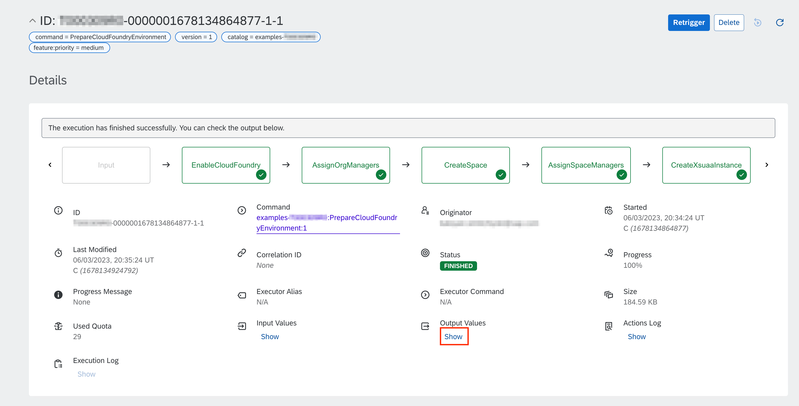
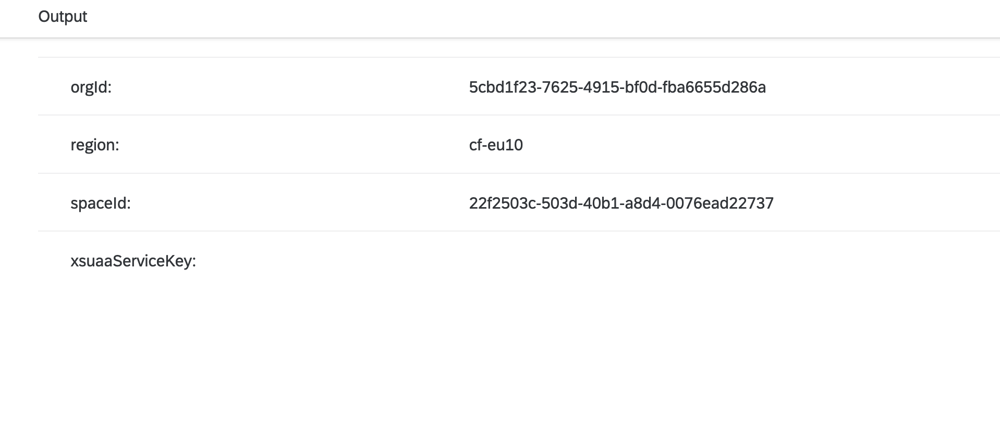

# Setup Cloud Foundry BTP Environment

Table of Contents

* [Description](#description)
* [Requirements](#requirements)
* [How to use](#how-to-use)
* [Expected result](#expected-result)

## Description

As a continuation of the [Create and Configure BTP Subaccount](../prepare-btp-subaccount) example, we can use SAP Automation Pilot to fully setup the Cloud Foundry environment in an already existing BTP subaccount.

The example command utilizes the **SAP Cloud Management Service (cis-sapcp)** and **Cloud Foundry (cf-sapcp)** provided catalogs to:

* Enable the Cloud Foundry environment
* Assign the *OrgManager* to the specified users
* Create a Cloud Foundry space
* Assign the *SpaceManager* role to the specified users.
* Create service instance and key of *SAP Authorization and Trust Management Service (plan apiacces)*, which can be used to manage users on subaccount level. To learn how to manage users and their privileges on subaccount level, please check for [Grant Privileges Example](../grant-privileges/).

:information_source: Make sure to check the other examples in the [BTP Provisioning](../README.md#btp-provisioning) section.

## Requirements

To use this example you'll need the following:

* BTP subaccount
* Platform user with access to the BTP subaccount
* Instance of [SAP Cloud Management Service](https://discovery-center.cloud.sap/serviceCatalog/8ffcd3a4-2d85-4a04-a762-be3e31f78a7c) with plan *local* and a service key/binding with default configurations. They must be created in a same BTP subaccount.

:warning: If you are planning to use SAP Universal ID, please keep [SAP Note 3085908](https://launchpad.support.sap.com/#/notes/3085908) in mind

Check out the following resources for more information:

* [Example: Create and Configure BTP Subaccount](../prepare-btp-subaccount/)
* [Getting Started in the Cloud Foundry Environment](https://help.sap.com/docs/btp/sap-business-technology-platform/getting-started-in-cloud-foundry-environment)
* [Getting Access to SAP Cloud Management Service](https://help.sap.com/docs/BTP/65de2977205c403bbc107264b8eccf4b/3670474a58c24ac2b082e76cbbd9dc19.html)
* [SAP Cloud Management Service - Service Plans](https://help.sap.com/docs/btp/sap-business-technology-platform/sap-cloud-management-service-service-plans)

## How to use

Import the content of [examples catalog](catalog.json) in your Automation Pilot tenant. Navigate to the *PrepareCloudFoundryEnvironment* command and trigger it.

You'll need to provide values for the following input keys:

* *org* - Display name of the Cloud Foundry organization
* *space* - Display name of the Cloud Foundry space
* *admins* - Additional users that will receive the *OrgManager* and *SpaceManager* roles
* *user* - UserID/Email for BTP user account used for authentication
* *password* - Password for BTP user account used for authentication
* *serviceKey* - The original JSON, presented by *SAP Cloud Management Service (plan local)*

You'll receive the following output values after successfuly executing the command:

* *orgId* - GUID of the Cloud Foundry organization
* *spaceId* - GUID of the Cloud Foundry space
* *region* - Technical name of the SAP BTP region in which the environment was enabled
* *xsuaaServiceKey* - Service Key for *SAP Authorization and Trust Management Service (plan apiaccess)*

:information_source: The region in which the environment was enabled might be different than the region of the subaccount.

:information_source: The  *xsuaaServiceKey* output is marked as sensitive and its value cannot be displayed in the UI. However, it can be referenced and used when composed in another command.

## Expected result

Let's execute the *PrepareCloudFoundryEnvironment* command with the following input:

* *org* - example-organization-d174df
* *space* - example-space
* *admins* - ["john.doe@sap.com"] *Note: Use your Email address*
* *user* - *BTP technical user*
* *password* - *BTP technical user password*
* *serviceKey* - *Service key for SAP Cloud Management Service (plan local)*

Execution is started and we can monitor its progress:

After a few seconds, the execution should finish successfully:

:information_source: The value of *xsuaaServiceKey* is not displayed because it's marked as sensitive.

We can verify that the command was successful by checking the BTP subaccount overview:

Cloud Foundry space has a single service instances with binding:

