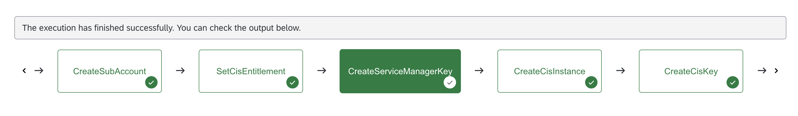
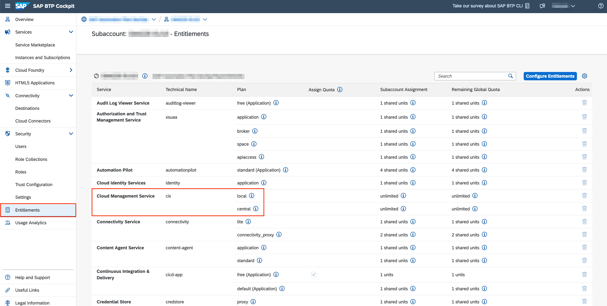
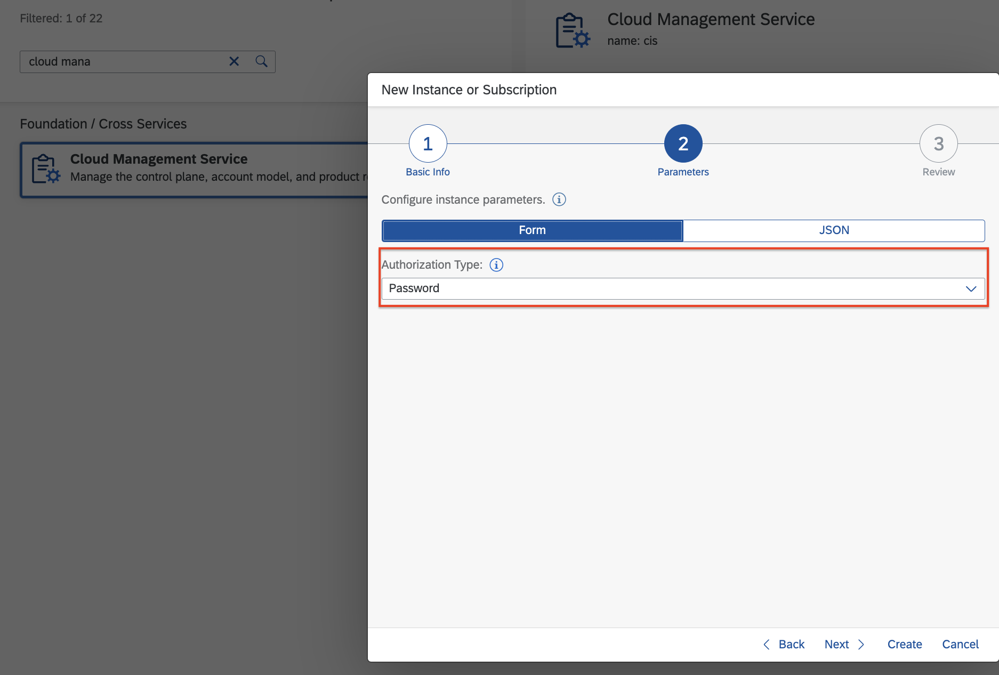
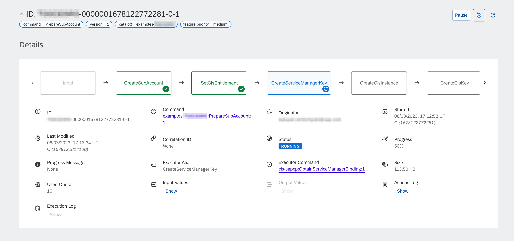
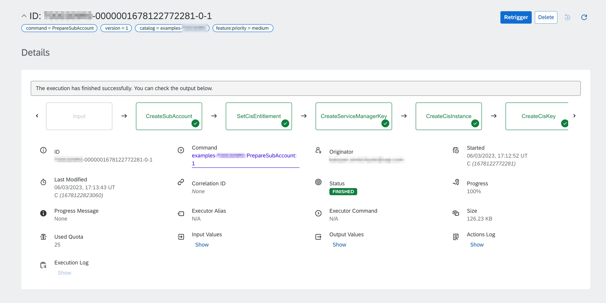
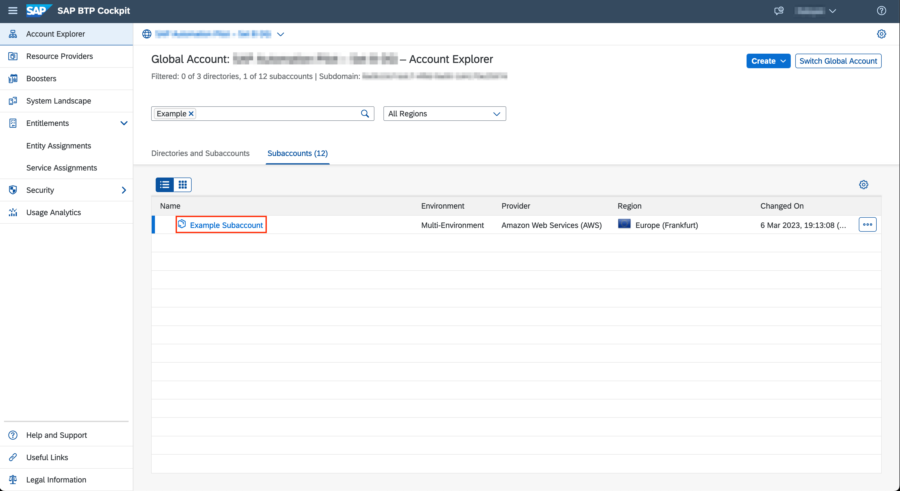
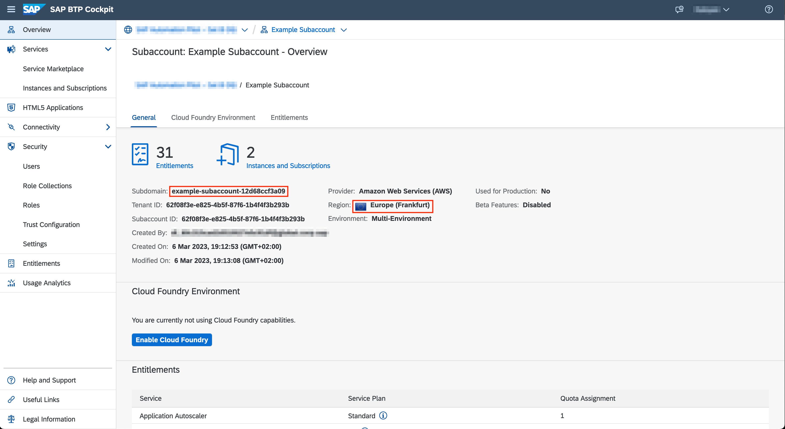
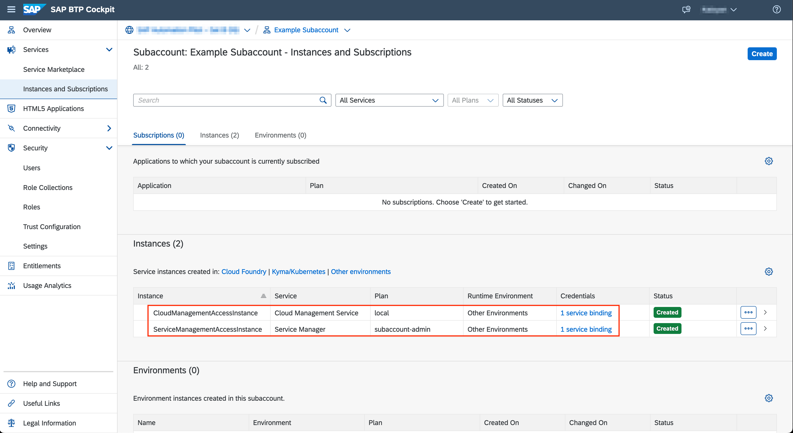

# Create and Configure BTP Subaccount

Table of Contents

- [Create and Configure BTP Subaccount](#create-and-configure-btp-subaccount)
  - [Description](#description)
  - [Requirements](#requirements)
  - [How to use](#how-to-use)
  - [Expected result](#expected-result)

## Description

In this example, we'll explore the capabilities of SAP Automation Pilot to create subaccounts and make basic configurations.

The example command utilizes the **SAP Cloud Management Service (cis-sapcp)** provided catalog to:

* Create new BTP subaccount.
* Configure entitlement for *SAP Cloud Management Service (cis)*.
* Create service instance and key of *SAP Service Manager*, which can be used to manage service instances.
* Create service instance and key of *SAP Cloud Management Service (plan local)*, which can be used to setup environments and subscriptions.

Customers can easily modify the example command to fit their scenarios. For example, adding additional entitlements or creating additional service instances.

:information_source: Both the *Service Manager* and *Cloud Management Service* catalogs work with the technical names of the services and their plans. You can find their values in your BTP subaccount, under *Entitlements*:

:warning: The example command is designed to ensure that the available subaccount is not deleted in the event of a failure.
:information_source: Make sure to check the other examples in the [BTP Provisioning](../README.md#btp-provisioning) section.

## Requirements

To use this example you'll need the following:

* BTP global account
* Platform user with access to the BTP global account and administrator roles in the subaccount where the key will be created in the CIS Central service instance
* Enable Entitlements for Cloud Management Service in both the global account in BTP and the subaccount with the `central` plan
* Instance of [SAP Cloud Management Service](https://discovery-center.cloud.sap/serviceCatalog/8ffcd3a4-2d85-4a04-a762-be3e31f78a7c) with plan *central* and a service key/binding with default configurations. They must be created in a separate BTP subaccount in the same global account. When creating the service instance you must choose Password as the Authorization Type:

:warning: If you are planning to use SAP Universal ID, please keep [SAP Note 3085908](https://launchpad.support.sap.com/#/notes/3085908) in mind

Check out the following resources for more information:

* [Getting a Global Account](https://help.sap.com/docs/btp/sap-business-technology-platform/getting-global-account)
* [Getting Access to SAP Cloud Management Service](https://help.sap.com/docs/BTP/65de2977205c403bbc107264b8eccf4b/3670474a58c24ac2b082e76cbbd9dc19.html)
* [SAP Cloud Management Service - Service Plans](https://help.sap.com/docs/btp/sap-business-technology-platform/sap-cloud-management-service-service-plans)

## How to use

Import the content of [examples catalog](catalog.json) in your Automation Pilot tenant. Navigate to the *PrepareSubAccount* command and trigger it.

You'll need to provide values for the following input keys:

* *displayName* - Display name of the BTP subaccount
* *region* - Technical name of the BTP region, where the subaccount will be created
* *subdomain* - Subdomain of the BTP subaccount
* *admins* - Additional users with subaccount administrator role collection
* *user* - UserID/Email for BTP user account used for authentication
* *password* - Password for BTP user account used for authentication
* *serviceKey* - The original JSON, presented by *SAP Cloud Management Service (plan central)*

You'll receive the following output values after successfuly executing the command:

* *cisServiceKey* - Service Key for *SAP Cloud Management Service (plan local)*
* *smServiceKey* - Service key for *SAP Service Manager (plan subaccount-admin)*

:information_source: These output values are marked as sensitive and their value cannot be displayed in the UI. However, they can be referenced and used when composed in another command.

## Expected result

Let's execute the *PrepareSubAccount* command with the following input:

* *displayName* - Example Subaccount
* *region* - cf-eu10
* *subdomain* - example-subaccount-12d68ccf3a09
* *admins* - ["john.doe@sap.com"] *Note: Use your Email address*
* *user* - *BTP technical user*
* *password* - *BTP technical user password*
* *serviceKey* - *Service key for SAP Cloud Management Service (plan central)*

Execution is started and we can monitor its progress:

After a few seconds, the execution should finish successfully:

We can verify that the command was successful by checking BTP Cockpit:

Subaccount has the correct region, display name and subdomain:

Subaccount has two services instances with bindings:

