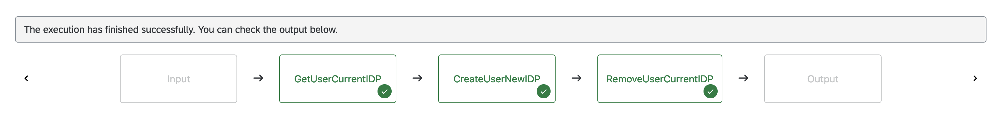

# Reassign Identity Provider

Table of Contents

* [Description](#description)
* [Requirements](#requirements)
* [How to use](#how-to-use)

## Description

SAP BTP supports the use of customer's own corporate identity provider for platform users. In this example, we'll use the SAP Automation Pilot to automate the migration from one identity provider (e.g. sap.ids) to another on a BTP subaccount level.

This example provides two commands which utilize the **SAP Authorization and Trust Management Service (xsuaa-sapcp)** provided catalog.

**ReassignIdentityProvider** performs the following actions on the target user:

* Gets all role collections which are assigned to the user
* Assigns the user to the new identity provider by keeping their original set of role collections
* Removes the user from the old identity provider

**MassReassignIdentityProvider** performs the following actions in the target BTP subaccount:

* Lists all users in the subaccount
* Performs the *ReassignIdentityProvider* command on each user

:information_source: Make sure to check the other examples in the [BTP Provisioning](../README.md#btp-provisioning) section.

## Requirements

To use this example you'll need the following:

* BTP subaccount
* Configured Cloud Foundry environment
* Instance of [SAP Authorization and Trust Management Service](https://discovery-center.cloud.sap/serviceCatalog/authorization-and-trust-management-service?region=all) with plan *apiaccess* and a service key/binding with default configurations
* One or more custom identity providers

Check out the following resources for more information:

* [Example: Create and Configure BTP Subaccount](../prepare-btp-subaccount/)
* [Example: Setup Cloud Foundry BTP Environment](../prepare-btp-environment/)
* [Getting Started in the Cloud Foundry Environment](https://help.sap.com/docs/btp/sap-business-technology-platform/getting-started-in-cloud-foundry-environment)
* [SAP Authorization and Trust Management Service](https://help.sap.com/docs/CP_AUTHORIZ_TRUST_MNG)
* [Access Administration Using APIs of the SAP Authorization and Trust Management Service](https://help.sap.com/docs/btp/sap-business-technology-platform/access-administration-using-apis-of-sap-authorization-and-trust-management-service)
* [Trust and Federation with Identity Providers](https://help.sap.com/docs/btp/sap-business-technology-platform/trust-and-federation-with-identity-providers)

## How to use

Import the content of [examples catalog](catalog.json) in your Automation Pilot tenant. Navigate to the *MassReassignIdentityProvider* command and trigger it.

You'll need to provide values for the following input keys:

* *currentIdentityProvider* - Origin key of the identity provider that is currently assigned to the users. For example: sap.ids
* *newIdentityProvider* - Origin key of the identity provider that must be assigned to the users. For example: a1rwcluzy-platform
* *serviceKey* - The original JSON, presented by *SAP Authorization and Trust Management Service (plan apiaccess)*

After the successful execution of the command, you can check which users were reassigned to another identity provider:

To reassign the identity provider of a single user, navigate to the *ReassignIdentityProvider* command and trigger it.

You'll need to provide values for the following input keys:

* *targetUser* - Email address of the target user which identity provider must be reassigned.
* *currentIdentityProvider* - Origin key of the identity provider that is currently assigned to the user. For example: sap.ids
* *newIdentityProvider* - Origin key of the identity provider that must be assigned to the user. For example: a1rwcluzy-platform
* *serviceKey* - The original JSON, presented by *SAP Authorization and Trust Management Service (plan apiaccess)*

:information_source: You can verify the result of your executions by navigating to your BTP subaccount and choosing **Security -> Users**.
