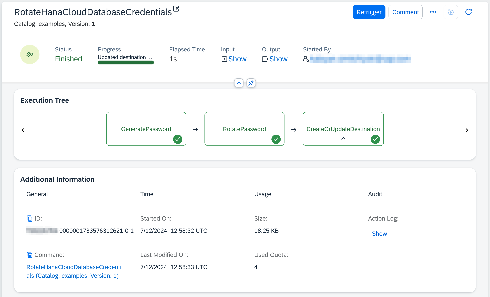
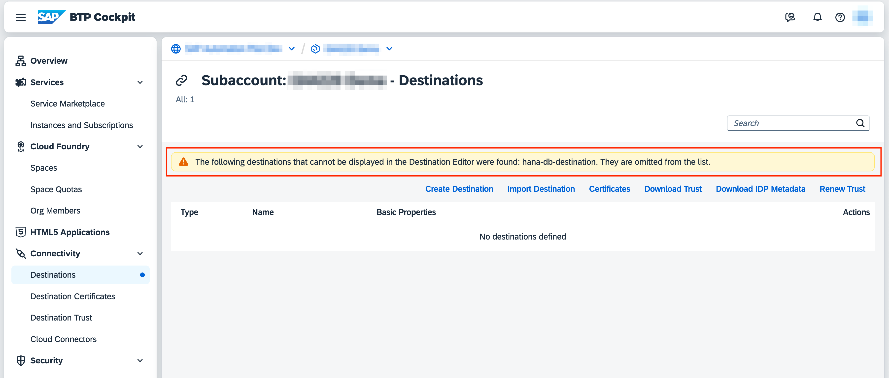

# Rotate HANA Cloud Database Credentials

Table of Contents

* [Description](#description)
* [Requirements](#requirements)
* [How to use](#how-to-use)
* [Expected result](#expected-result)

## Description

This example demonstrates how to automate the rotation of credentials for a HANA Cloud database. Credential rotation is an important security practice that helps to minimize the risk of unauthorized access by periodically updating passwords. Regularly rotating database credentials is essential for maintaining the security of your database. This example automates the process, reducing the operational effort and ensuring that credentials are updated consistently and securely.

In addition, this example can be run on demand or scheduled to run on a regular basis to ensure that database credentials are rotated periodically:

* **Weekly Rotation**: Schedule the automation to run every Sunday at 10 PM.
* **Monthly Rotation**: Schedule the automation to run on the first day of every month at 9 AM.
* **Quarterly Rotation**: Schedule the automation to run on the first day of every quarter (January 1st, April 1st, July 1st, October 1st) at 10 AM.

The provided automation performs the following steps:

1. **Generate a New Password**: Generates a new password of a specified length using the [GENERATE_PASSWORD](https://help.sap.com/docs/hana-cloud-database/sap-hana-cloud-sap-hana-database-sql-reference-guide/generate-password-function-security) function in HANA Cloud
2. **Rotate the Password**: Updates the password for the specified HANA Cloud user with the newly generated password.
3. **Update Destination Service Destination**: Updates the SAP Destination Service with the new credentials, ensuring that any applications using this service can continue to connect to the HANA Cloud database.

## Requirements

To use this example you'll need the following:

* **SAP Automation Pilot Tenant**: Ensure you have access to an SAP Automation Pilot tenant.
* **HANA Cloud Database**: A HANA Cloud database instance where the credentials will be rotated.
* **SAP Destination Service**: An SAP Destination Service instance and a service key to store the new credentials.
* **Admin Database User**: Credentials for an admin database user that will be used for the rotation.
* **Whitelisted IP Addresses**: Ensure that the HANA Cloud database allows access from [SAP Automation Pilot addresses](https://help.sap.com/docs/automation-pilot/automation-pilot/what-is-sap-automation-pilot?locale=en-US#service-availability) by whitelisting them.

## How to use

1. **Import the Example**:

* Copy the content of the [catalog.json](./catalog.json) file.
* Go to your SAP Automation Pilot tenant and navigate to `My Catalogs`.
* Click on `Import` in the upper right corner.
* Paste the catalog's content and import it.

2. **Trigger the Command Manually**:

* Navigate to the `RotateHanaCloudDatabaseCredentials` command in your SAP Automation Pilot tenant.
* Click on the *Trigger* button after getting familiar with the command
* Provide values for the following input keys:
  * `password`: Password for the admin database user that will be used for rotation.
  * `userToRotate`: Name of the database user whose password will be rotated.
  * `destinationName`: Name of the SAP Destination Service destination where the new password will be stored.
  * `connectionUrl`: Connection URL for access to the HANA Cloud database.
  * `user`: Name of the admin database user that will be used for rotation.
  * `passwordLength`: Length of the new password (optional, default is 16).
  * `destinationServiceKey`: Service key for SAP Destination Service.
* Confirm and start the automation

## Expected result

After successfully executing the example, the password for the specified HANA Cloud user will be updated with the newly generated one:

The SAP Destination Service destination will be updated with the new credentials.

:information_source: Note that this example uses a destination of type TCP, which is not visible in the SAP BTP cockpit. However, it can be retrieved from the APIs by our custom application, or other places integrated with the SAP Destination Service.

