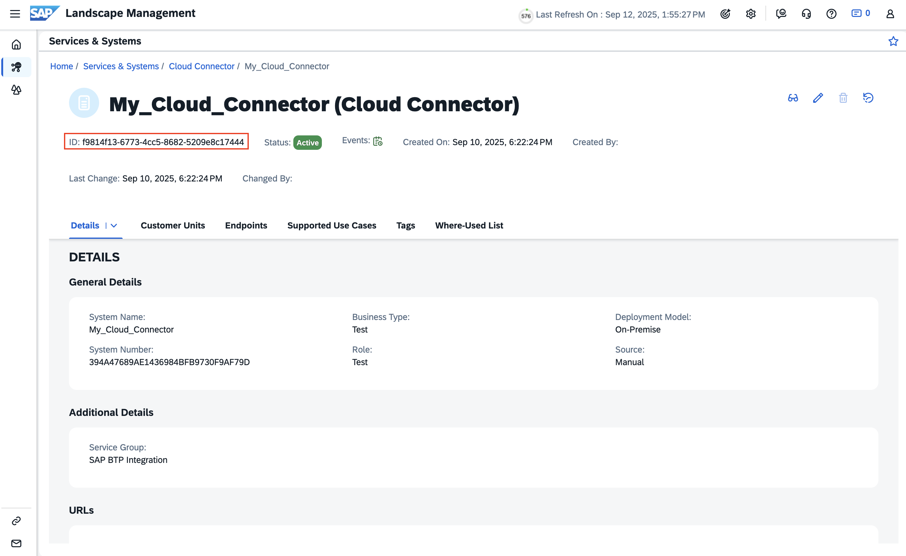
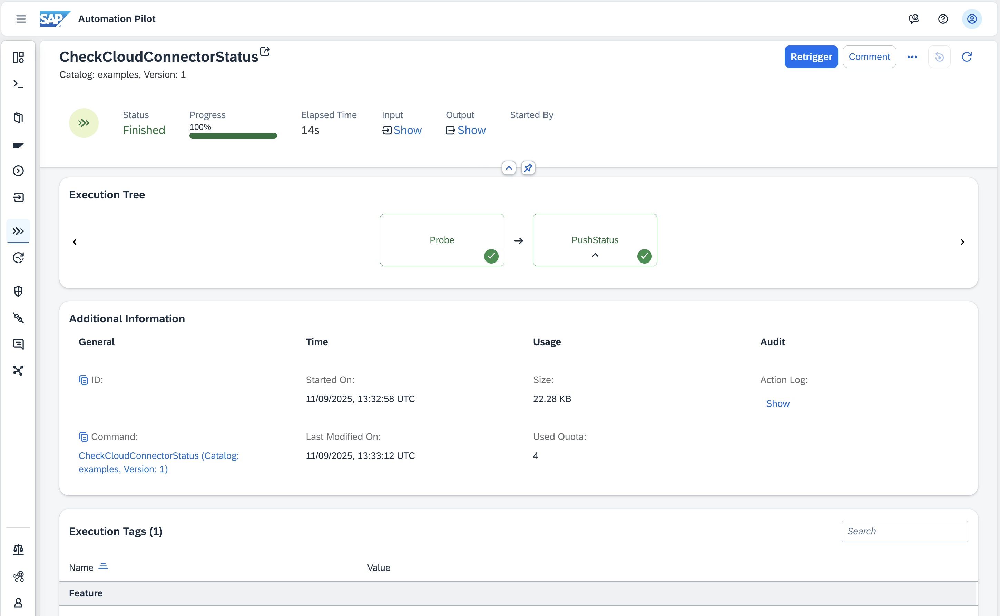
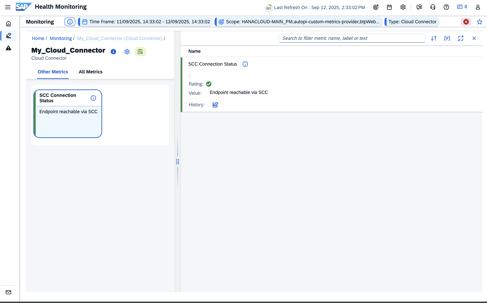
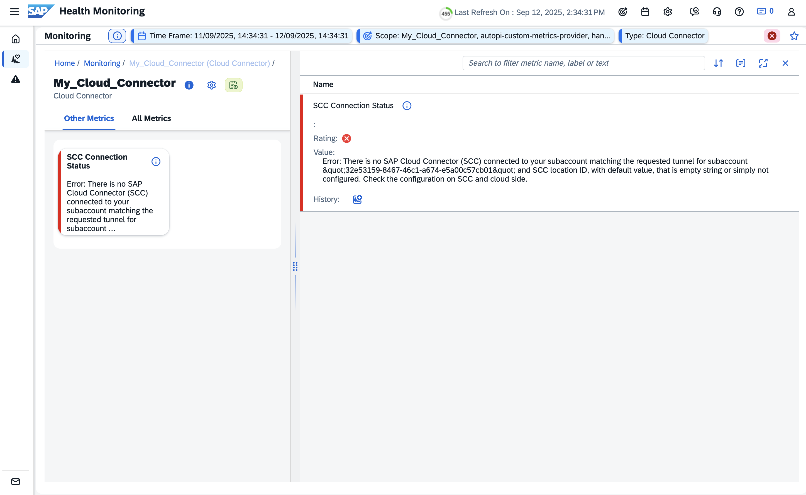

# SAP Cloud Connector Connection Status

Table of Contents

* [Description](#description)
* [Requirements](#requirements)
* [How to use](#how-to-use)
* [Schedule Regular Execution](#schedule-regular-execution)
* [Expected result](#expected-result)

## Description

This example helps you monitor the availability and connectivity of your on-premise endpoints via SAP Cloud Connector. It automates the process of checking if a specific endpoint is reachable through the Cloud Connector and immediately pushes the result to SAP Cloud ALM Health Monitoring. This enables proactive detection of connectivity issues and helps ensure business continuity.

The automation works by:

1. Sending a request to the specified endpoint through the SAP Cloud Connector.
2. Evaluating the response status code against your expected value.
3. Pushing the result (including status and message) to Cloud ALM Health Monitoring, where you can visualize the connection status and receive alerts if issues are detected.

Benefits:

* Early detection of connectivity problems between SAP BTP and on-premise systems.
* Automated health status reporting to Cloud ALM for centralized monitoring.
* Easily customizable messages, metric names, and reporting logic by adapting the automation.

:information_source: Note: The way data is displayed in Cloud ALM (messages, metric names, etc.) can be easily changed by adapting the automation logic.

## Requirements

To use this example you'll need the following:

* **SAP Automation Pilot Tenant**: Access to an SAP Automation Pilot tenant.
* **SAP Cloud Connector**: Connected to the same subaccount where Automation Pilot resides.
* **Exposed On-Premise HTTP Endpoint via Cloud Connector**: An HTTP-based endpoint (e.g., health/status URL) must be exposed through the SAP Cloud Connector so that the automation can attempt to reach it from the cloud. This is the endpoint whose accessibility will be monitored.
* **Cloud ALM Credentials**: Create a SAP Cloud ALM API service instance and service key as described in the [documentation](https://help.sap.com/docs/cloud-alm/setup-administration/enabling-sap-cloud-alm-api?locale=en-US). The service instance must be configured with the following parameters to provide access to the Health Monitoring APIs:
  ```json
  {
      "xs-security": {
          "authorities": [
            "$XSMASTERAPPNAME.calm-api.metrics.write",
            "$XSMASTERAPPNAME.calm-api.hm.write"
          ]
      }
  }
  ```
* **Cloud Connector Setup in Cloud ALM**: Configure your Cloud Connector in Cloud ALM by following this [guide](https://support.sap.com/en/alm/sap-cloud-alm/operations/expert-portal/setup-managed-services/setup-cloud-connector.html?anchorId=section_369985517_co).
  * Once configured, use the resulting service ID from Landscape Management.
  * 

## How to use

1. **Import the Example**:
   * Copy the content of the `catalog.json` file.
   * Go to your SAP Automation Pilot tenant and navigate to `My Catalogs`.
   * Click on `Import` and paste the catalog content.

1. **Update Cloud ALM Credentials Input**:
   * In the UI, navigate to `Inputs` → `CloudAlmCredentials`.
   * Edit the input and paste the full Cloud ALM service key JSON into the `serviceKey` (include the entire object exactly as received when creating the service key; do not extract individual fields).

1. **Trigger the Command**:
   * Find the `CheckCloudConnectorStatus` command in your catalog.
   * Click _Trigger_ and provide the required input values:
     * `virtualHost`: SCC virtual host mapped in Cloud Connector
     * `virtualPort`: SCC virtual port for the mapped system
     * `path`: URL path to check (e.g., /health)
     * `expectedStatus`: Expected HTTP status code (default: 200)
     * `sccLocationId`: Location ID of the Cloud Connector
     * `serviceKey`: Service key for Cloud ALM Health Monitoring
     * `serviceId`: Service ID from Cloud ALM Landscape Management
     * `timeout`: Timeout in seconds (default: 10)
   * Confirm and start the automation.

## Schedule Regular Execution

You can (and usually should) schedule this command to run automatically at a cadence that matches your operational needs (e.g., every 5 minutes, hourly, daily). Regular execution gives continuous visibility into connectivity health and helps you catch intermittent issues (DNS glitches, sporadic firewall drops, short on-prem outages) that a one-time manual check would miss.

Benefits of scheduling:

* Detects transient or intermittent connectivity failures early.
* Builds a historical availability timeline in Cloud ALM for trend analysis.
* Automates status publishing—no manual intervention required.
* Enables timely alerting and faster mean time to detection (MTTD).

Official docs: [Scheduled Execution](https://help.sap.com/docs/automation-pilot/automation-pilot/scheduled-execution?locale=en-US)

Steps to schedule `CheckCloudConnectorStatus`:

1. Open `Scheduled Executions` in the Automation Pilot UI.
1. Click `Schedule` to create a new schedule.
1. Configuration step:
   * Select command: `CheckCloudConnectorStatus`.
   * Select input: `CloudAlmCredentials` (resolves the `serviceKey`).
   * Add a clear description (e.g., "SCC connectivity probe every 15 minutes").
1. Parameters step: Fill all parameters (`virtualHost`, `virtualPort`, `path`, `expectedStatus`, `sccLocationId`, `serviceId`, `timeout`).
1. Schedule step: Choose cadence (e.g., every 5–15 minutes for critical systems, hourly for moderate, daily for low-criticality endpoints).
1. Advanced step: (Optional) enable extended execution logs for debugging failed probes.
1. Confirm to activate the schedule.
1. Review the schedule detail page to see next and last execution times.

Operational tip: Start slightly more frequent than you think you need (e.g., every 10–15 minutes) and adjust once stability is confirmed.

## Expected result

After execution, the status of the endpoint connectivity test will be pushed to Cloud ALM Health Monitoring. You will see the result (OK or Critical) and the message in Cloud ALM, allowing you to monitor and react to connectivity issues.






