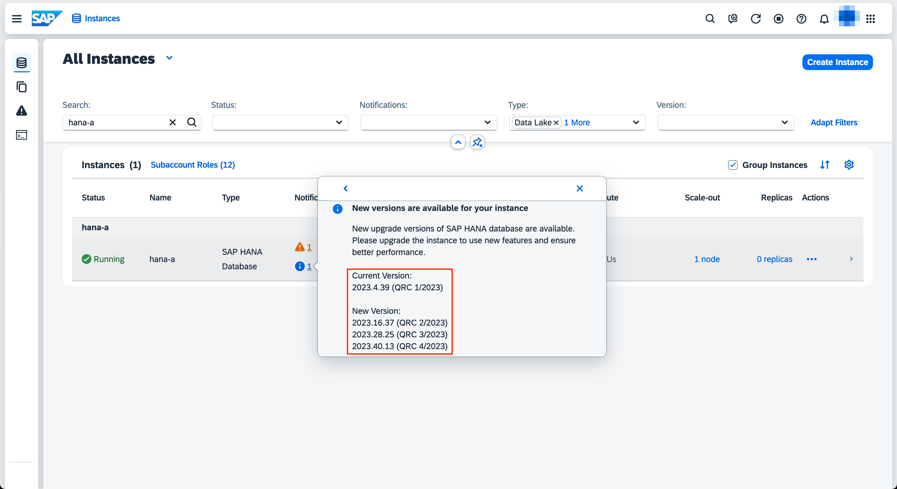
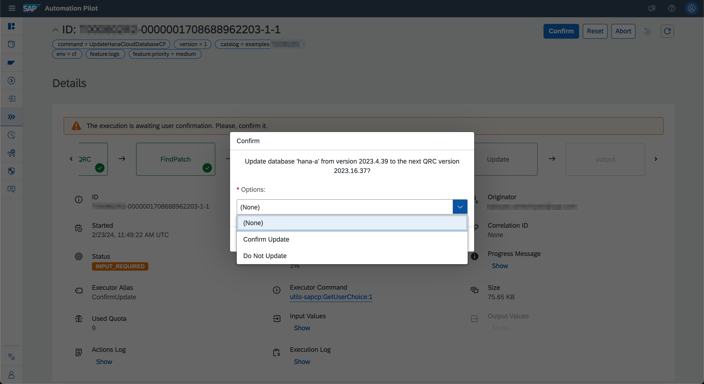
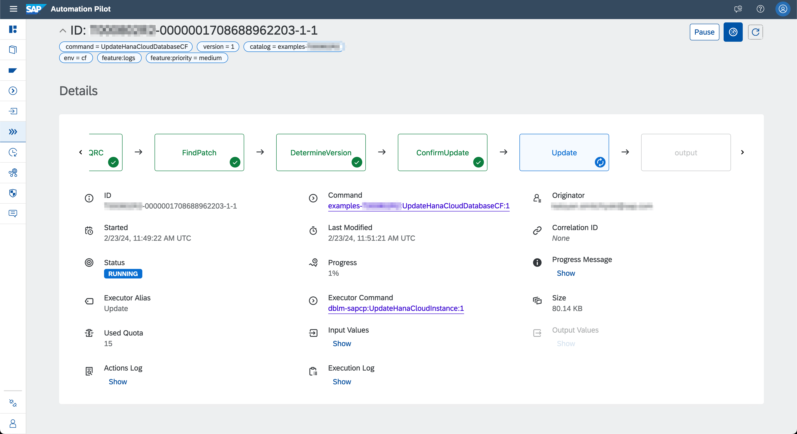
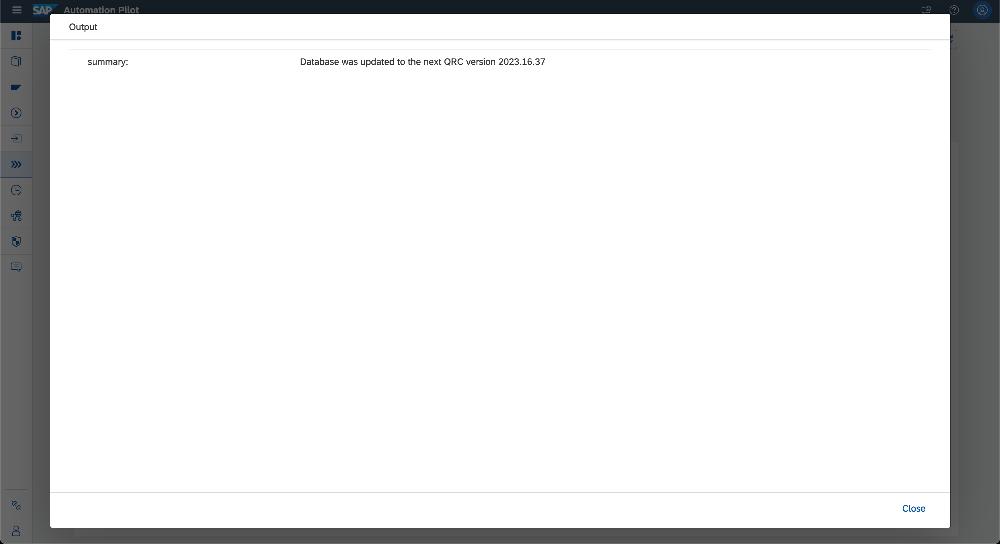

# Update of HANA Cloud Database

Table of Contents

* [Description](#description)
* [Requirements](#requirements)
* [How to use](#how-to-use)
* [Expected result](#expected-result)

## Description

SAP HANA Cloud releases new versions, also known as QRC (quarterly release cycle), every three months on the final day of each quarter. In between these QRC releases, patches containing bug fixes and other improvements are developed and made available.

Ensuring that your HANA Cloud database is updated consistently is crucial for maintaining its security, reliability, and access to new features. Without user intervention, HANA Cloud instances are forcefully updated seven months following a version release.

SAP Automation Pilot allows for complete automation of the update process. It can execute updates on a regular basis, entirely depending upon the customer's preference — weekly, monthly, quarterly, etc. Moreover, there's the choice of selecting a unique update strategy, enabling updates only to the latest patch version, the next available QRC version, or the latest possible QRC version.

The command in this example executes the following steps:

* Checks if an update is available based on the chosen update strategy.
* Optionally, pauses and awaits explicit confirmation before performing the update.
* Executes the update to the available version.
* If no suitable version is available, the execution terminates without proceeding any further.

Typically, an update requires the database to restart, resulting in downtime. Given this, the command pauses prior to the update until explicit confirmation is received from your DevOps team. If downtime is not an issue, or the database is configured to be updated without a restart, this confirmation can be disabled. For more information, visit this page: [Upgrading Without Restart](https://help.sap.com/docs/HANA_CLOUD/9ae9104a46f74a6583ce5182e7fb20cb/c26e42e6a7a4411191441c8d48fd9b11.html)

:warning: Please note: It is not possible to revert to a previous version once the upgrade is complete. We strongly advise verifying everything works as expected on a test system prior to applying the update to the production environment.

## Requirements

### Cloud Foundry Environment

If your HANA Cloud database is in the Cloud Foundry environment:

* HANA Cloud database in the *Cloud Foundry environment*.
* Platform user with *Space Developer* role in the space where the database resides.

:warning: Please note: If you are planning to use SAP Universal ID, please keep [SAP Note 3085908](https://launchpad.support.sap.com/#/notes/3085908) in mind

### Other Environment (Subaccount level)

If your HANA Cloud database is in the *Other environment*:

* HANA Cloud database in the *Other environment*.
* Instance of [SAP Service Manager](https://help.sap.com/docs/service-manager/sap-service-manager/sap-service-manager) with plan *subaccount-admin* and a service key.

Check out the following resources for more information:

* [Deploy SAP HANA Cloud](https://developers.sap.com/tutorials/hana-cloud-deploying.html)
* [Create Users and Manage Roles and Privileges](https://developers.sap.com/tutorials/hana-cloud-mission-trial-4.html)

## How to use

Import the content of [examples catalog](catalog.json) in your Automation Pilot tenant.

### Cloud Foundry Environment

If your HANA Cloud database is in the *Cloud Foundry environment*, navigate to the *UpdateHanaCloudDatabaseCF* command and trigger it.

You'll need to provide values for the following input keys:

* *updateStrategy* - Update strategies that allow you to update in a variety of ways depending on your needs (latest patch version, next QRC version, latest QRC version)
* *region* - Technical name of your SAP BTP region, e.g. cf-eu10, cf-us20, cf-eu10-004
* *org* - Name of your Cloud Foundry organization
* *space* - Name of your Cloud Foundry space
* *hanaCloudInstance* - Name of your HANA Cloud service instance
* *user* - Email or ID of your technical user
* *password* - Password of your technical user
* *identityProvider* - Optional: origin key of your identity provider. Defaults to sap.ids
* *shouldConfirmBeforeUpdate* - Optional: whether to require confirmation before starting the update, if there's one available. Defaults to true

:warning: Make sure that you using the correct *region* value by verifying it in the BTP Cockpit Overview page. For example, the region shown below is *cf-eu10-004*:

### Other Environment (Subaccount level)

If your HANA Cloud database is in the *Other environment*, navigate to the *UpdateHanaCloudDatabaseOtherEnv* command and trigger it.

You'll need to provide values for the following input keys:

* *updateStrategy* - Update strategies that allow you to update in a variety of ways depending on your needs (latest patch version, next QRC version, latest QRC version)
* *hanaCloudInstance* - Name of your HANA Cloud service instance
* *serviceKey* - Service key to the SAP Service Manager, plan subaccount-admin
* *shouldConfirmBeforeUpdate* - Optional: whether to require confirmation before starting the update, if there's one available. Defaults to true

### Scheduling

This command is most useful if executed regularly. Automation Pilot allows executions to be automatically triggered on regular intervals - hourly, daily, weekly, monthly or yearly. You can find more details in the [documentation](https://help.sap.com/docs/AUTOMATION_PILOT/de3900c419f5492a8802274c17e07049/96863a2380d24ba4bab0145bbd78e411.html).

Another important aspect is alerting. It's important to receive notifications (in the form of email, slack message, Jira ticket or other) whenever the command fails or is waiting for a confirmation before proceeding with the update. This could be easily achieved with the help of SAP Alert Notification. More information can be found [here](https://help.sap.com/docs/AUTOMATION_PILOT/de3900c419f5492a8802274c17e07049/e75533639c6d4193aa8a7e7420c25f8c.html).

## Expected result

Let's execute the *UpdateHanaCloudDatabaseCF* command on a HANA Cloud database with multiple available QRC versions:

We'll trigger it with *updateStrategy=next QRC version*. After finding the available QRC version, the execution halts:

:information_source: The update confirmation can be disabled by triggering the command with `shouldConfirmBeforeUpdate=false`. This way the update will be performed completely automatically.

Clicking on the *Confirm* button will present us with a dialog. We'll need to decide whether we want to continue with the update or abort it. For the sake of the demonstration, we'll confirm it:

The execution begins the update to next QRC version. It might take a while, depending on the size of your database and its configuration.

Eventually the execution finishes successfully:

Clicking on *Output Values* will show us a short summary which is useful for transparency and traceability:

We can also verify that the update was successful by checking the version in SAP HANA Cloud Central:

